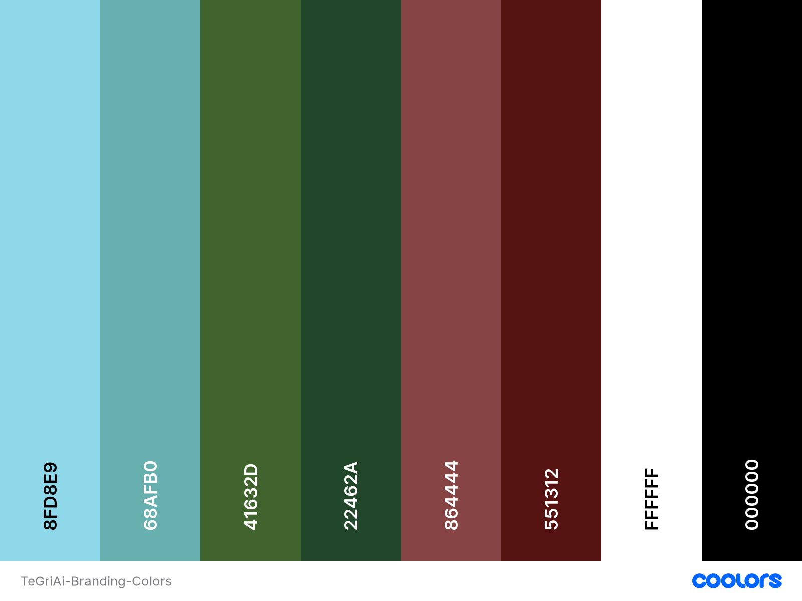

## צבעים
צבעים הם חלק חשוב מאוד מהמותג שלנו, ולכן יש להשתמש בהם בצורה נכונה ולא להשתמש בצבעים שלא מופיעים בטבלה הבאה.

להלן קישור לטבלת הצבעים שלנו:
[טבלת צבעים](https://coolors.co/8fd8e9-68afb0-41632d-22462a-864444-551312-ffffff-000000)

import ColorPalette from '@site/src/components/ColorPalette';

<ColorPalette />

## רשיון וזכויות יוצרים
במידה ותרצו להשתמש במיתוג שלנו, יש להקפיד בהכרח על הישמימות לסטנדרטים הנקבעים במדריך הצבעים ולעמוד בכל ההנחיות הקשורות למיתוג בתחום המסוים או הקטגוריה המרכזית בה מבוצעת השימוש. הפרטים כמו שימוש בגוונים, אילוצי גופנים, ופרטים אחרים הקשורים להזדהות החזותית של המיתוג אמורים להימנע כמו שהוזכרים בהנחיות ובמסמכים הרלוונטיים.