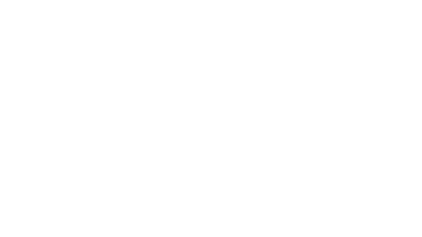
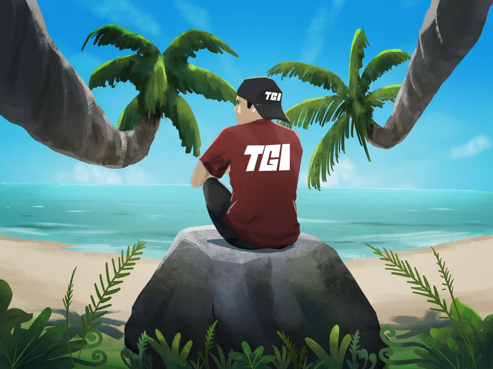

# פונטים
- [Rubik](https://fonts.google.com/specimen/Rubik)
- [Varela Round](https://fonts.google.com/specimen/Varela+Round)
- [Rubik Mono One](https://fonts.google.com/specimen/Rubik+Mono+One)

## צבעים
-  `#11111B`
-  `#292841`
-  `#41632D`
-  `#FFFFFF`
-  `#22462A`
-  `#666666`
-  `#551312`
-  `#000000`
-  `#333333`
-  `#7289DA`

## לוגו

:::note[מידע]
אפשר למצוא את המיתוג המלא של הקהילה [github](https://github.com/tgilabs) שלנו
:::

## סלוגן
המקום הכי ישראלי ברשת 🇮🇱

## רקע
 

:::note[מידע]
אפשר למצוא את המיתוג המלא של הקהילה [github](https://github.com/tgilabs) שלנו
:::