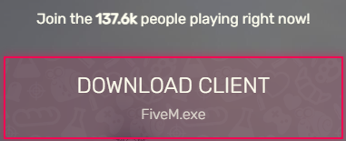
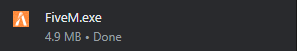
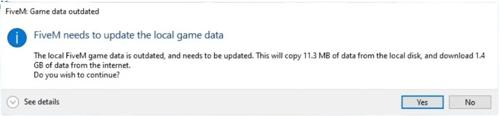

## הדברים הנחוצים בשביל לשחק בשרת
בשביל לשחק בשרת, תצטרכו מחשב (אין תמיכה בקונסולות), משתמש המכיל GTA (לא משנה מאיפה קניתם, הדבר הכי חושב הוא שחיברתם אותו למשתמש רוקסטאר), GTA מותקן ומורד על המחשב ולפחות 10 - 20 GB באחד מהכוננים במחשב שלכם

## תהליך הורדת המשחק

עכשיו הגיע הזמן להוריד פייבאם!
דבר ראשון, תצטרכו להיכנס [לאתר הרשמי שלהם](https://fivem.net/) כדי להוריד את המשחק.

לאחר שנכנסתם לאתר, יש ללחוץ על הכפתור המוצג למעלה ומשם יפתחו לכם תנאי השימוש של פייבאם, לאחר כך תגללו למטה ותלחצו על "SURE, I AGREE" בשביל להסכים לתנאי השימוש (אין שום דבר בתנאי השימוש שיכול לגרום לכם נזק)

לאחר מכן ירד לכם הקובץ הזה ופשוט תצטרכו ללחוץ עליו ותהליך ההורדה יתחיל.

אחרי שתהליך ההורדה הראשוני הסתיים, תיפתח לכם אופצייה לבחור איפה המשחק (GTA) מותקן (אם לא נפתחה לכם האופצייה הזאת סימן שנמצאה לבד התיקייה)

מקומות התקנה לפי חנויות:

Steam: C:\Program Files (x86)\Steam\steamapps\common\Grand Theft Auto V

Epic Games: C:\Program Files\Epic Games\GTAV

Rockstar Games: C:\Program Files\Rockstar Games\Grand Thef Auto

אם אתם לא מוצאים את ההמשחק באחד מהתיקיות האלו, סימן שהתקנתם את המשחק בתיקייה אחרת/בכונן אחר.

לאחר מכן תתחיל סריקה על קבצי המשחק ותצצוץ ההודעה הזאת:

תצטרכו פשוט ללחוץ על "YES" בצד ימין למטה ולחכות שההתקנה האחרונה תסתיים.

שההורדה האחרונה תסתיים, יפתח לכם דף המבקש ממכם להיכנס למשתמש Rockstar/Social Club הכולל בו GTA

(במידה ויש לך Rockstar Launcher על המחשב/אתם לא רואים את הדף הזה, זה אומר שהמשחק זיהה את המשתמש שלכם לבד)

משתמש זה אמור להיות מחובר למשתמש שממנו קנית את המשחק, למשל: מחובר למשל Steam אם קניתם את המשחק משם

(אם קניתם את המשחק מ PlayStation/XBOX זה גם יעבוד)

ולבסוף לאחר מכן הפייבאם יפתח וסיימתם את תהליך ההתקנה

