# דירת התחלה
במדריך זה תקבלו מידע לגבי הדירה שתקבלו מתי שתצרו דמות

## מתי מקבלים את הדירה?

לאחר שתסיימו לעצב את הדמות שלכם, אתם תקומו בתוך דירה והיא תהיה שלכם

כולם מקבלים דירה באותו בניין אבל הדירה היא אישית לכל אחד

## איפה נמצאת הדירה?

הדירה נמצאת במיקום הזה במפה

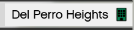

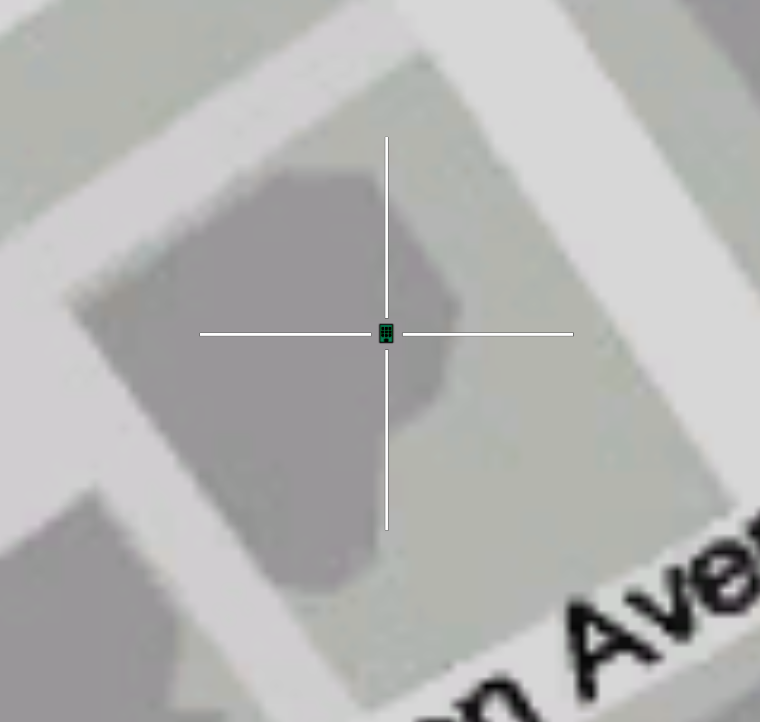

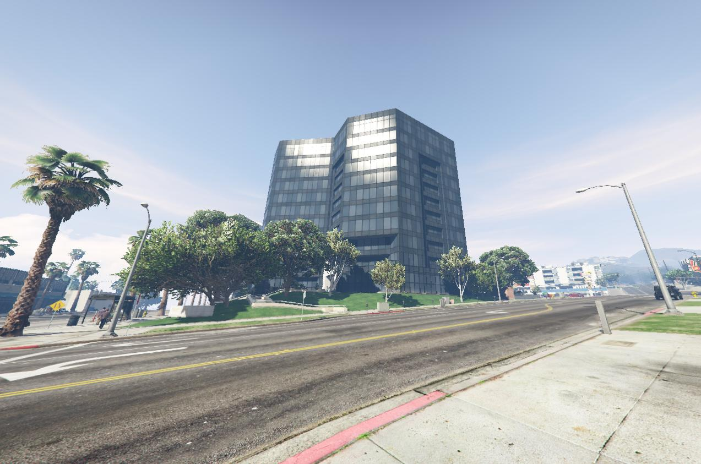

## איך נכנסים לדירה?

ישנם שני דרכים להיכנס לדירה

דרך אחת זה מתי שבחורים את הדמות

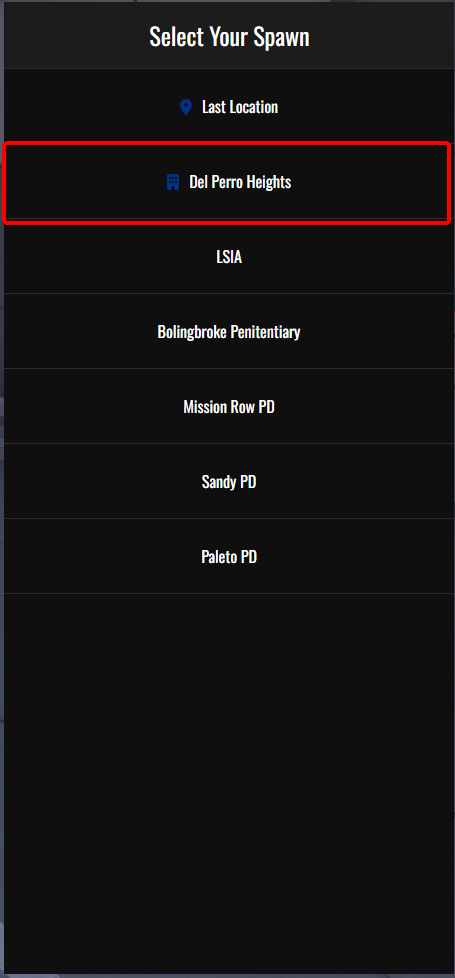

דרך שנייה זה להגיע לבניין הדירה וללחוץ על "E" (או על המקש המרכזי שלכם במידה ושיניתם בהגדרות)

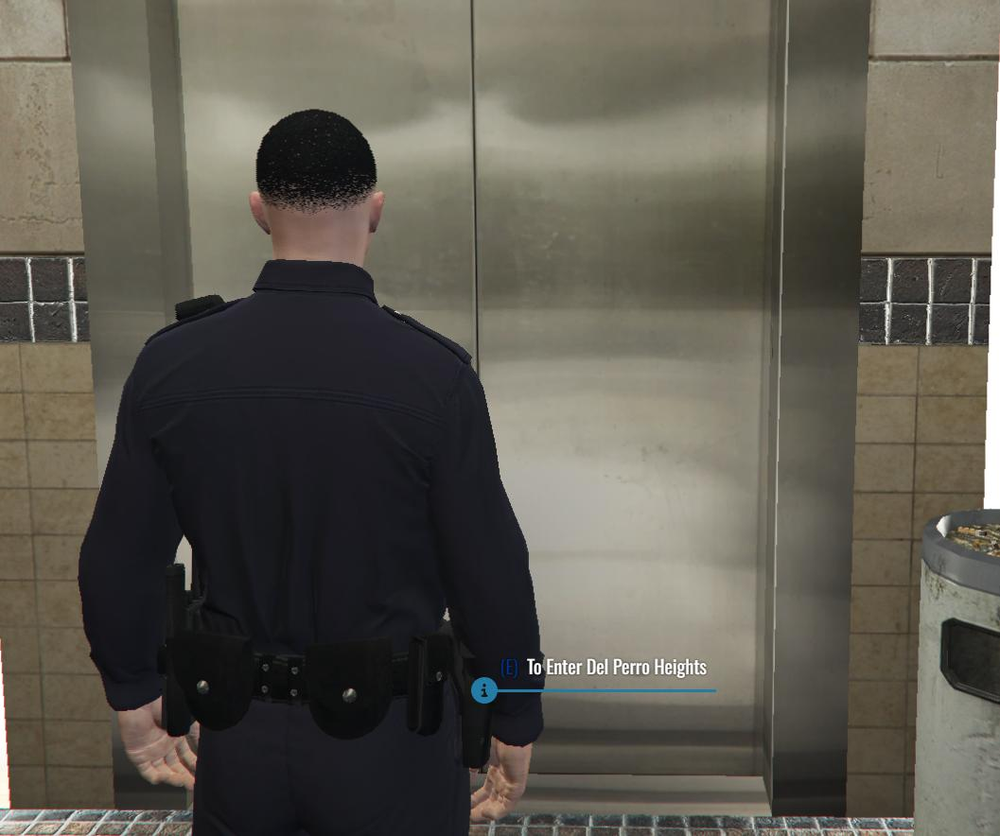

## האינטרקציות בדירה

בדירה זו תוכלו לעשות מגוון דברים כמו:

**לאחסן חפצים אישיים**

**להחליף תלבושות**

**ולהתחלף מדמות לדמות בלי לצאת מהשרת**

### מיקומים של כל אינטרקצייה

הדירה משתמשת במערכת האינטרקצייה "נקודת הפעולה"

לפני שאתם ניגשים לאינטרקציות בבית אנחנו ממליצים לכם להבין איך המערכת עובדת

[למדריך על נקודת הפעולה](interactions/targeting.md)

#### מקום האחסון

מקום האחסון נמצא בחדר השינה, בארון מול המיטה ליד השולחן מחשב

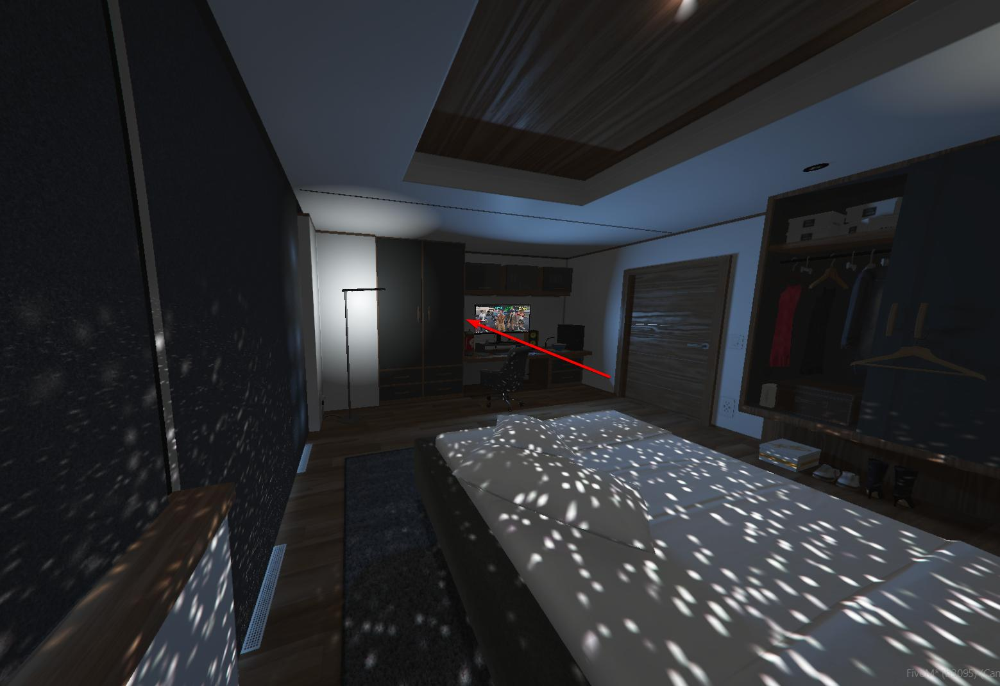

אתם מקבלים מקום אחסון עם מקום ל 24 אביזרים שונים ומשקל של 400 פאונד

#### ארון הבגדים

ארון הבגדים נמצא בחדר השינה מצד ימין למיטה

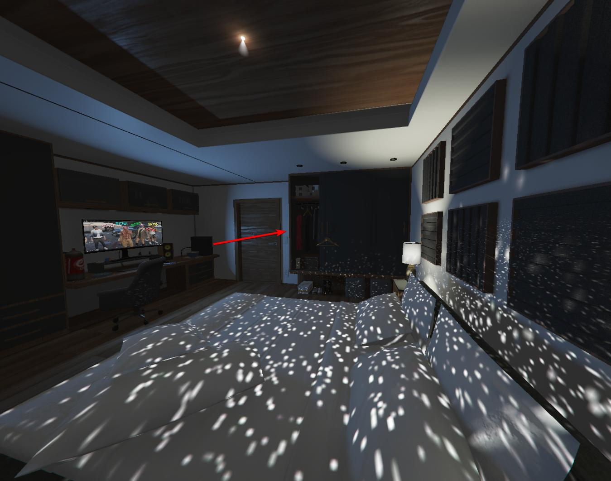

בארון הבגדים תוכלו לשמור חליפות ולהשתמש בחליפות שמורות

#### החלפת הדמות

החלפת הדמות נמצאת על המיטה בחדר השינה

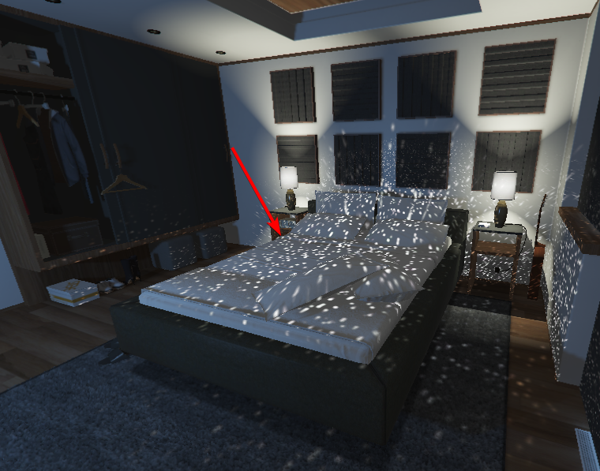

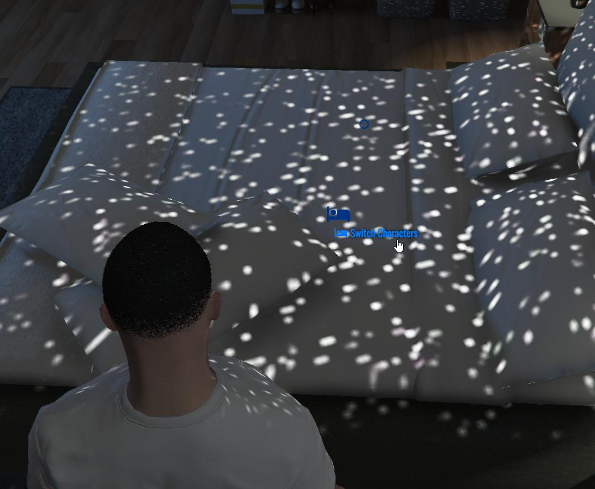

פה תוכלו להחליף בין הדמויות שלכם בלי לצאת מהשרת ובמהירות 

## איך יוצאים מהדירה?

תצטרכו להגיע למעלית שנמצא בחוץ

(הניווט הוא מחדר השינה)

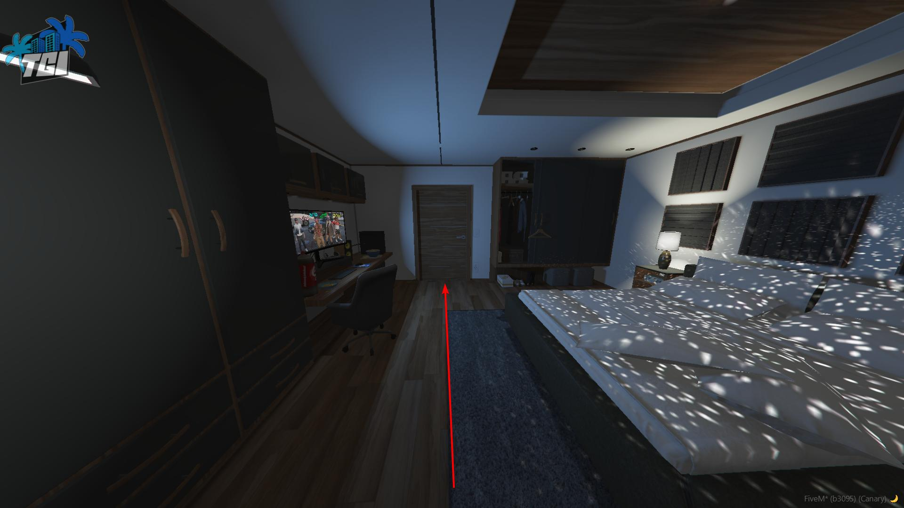
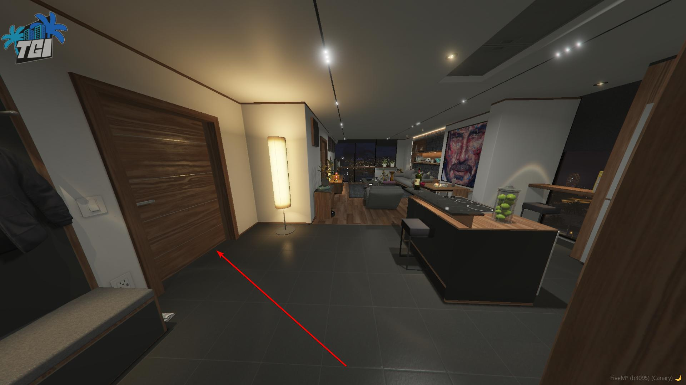
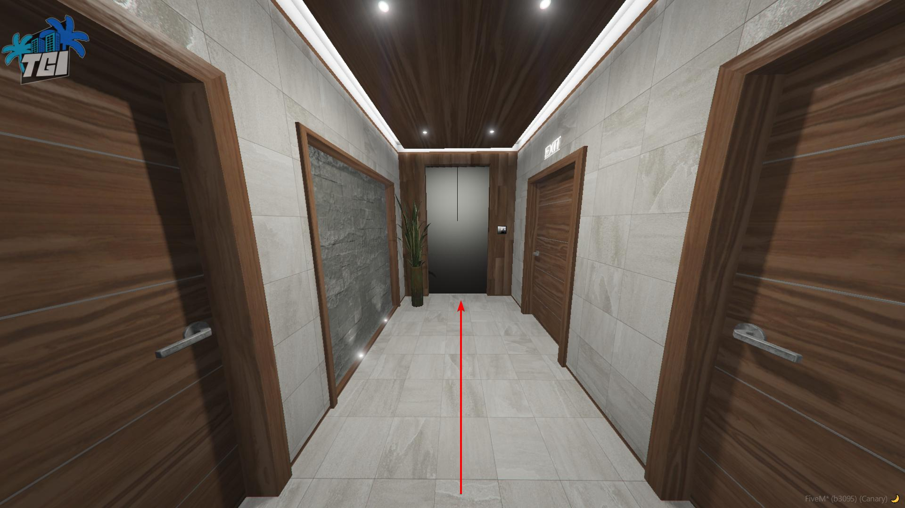

ובתוך המעלית תוכלו להשתמש "נקדות הפעולה"

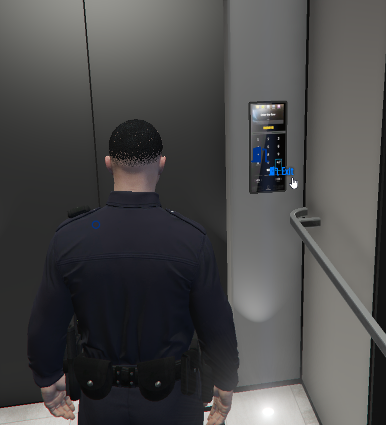

## איך ממשיכים מכאן אם אני מדמות חדשה?

מומלץ שלאחר שיצאתם מהדירה תקראו על מערכת השכרות הרכב שלנו ושם תלמדו איך תוכלו להתנייד בשרת בהתחלה בקלות
