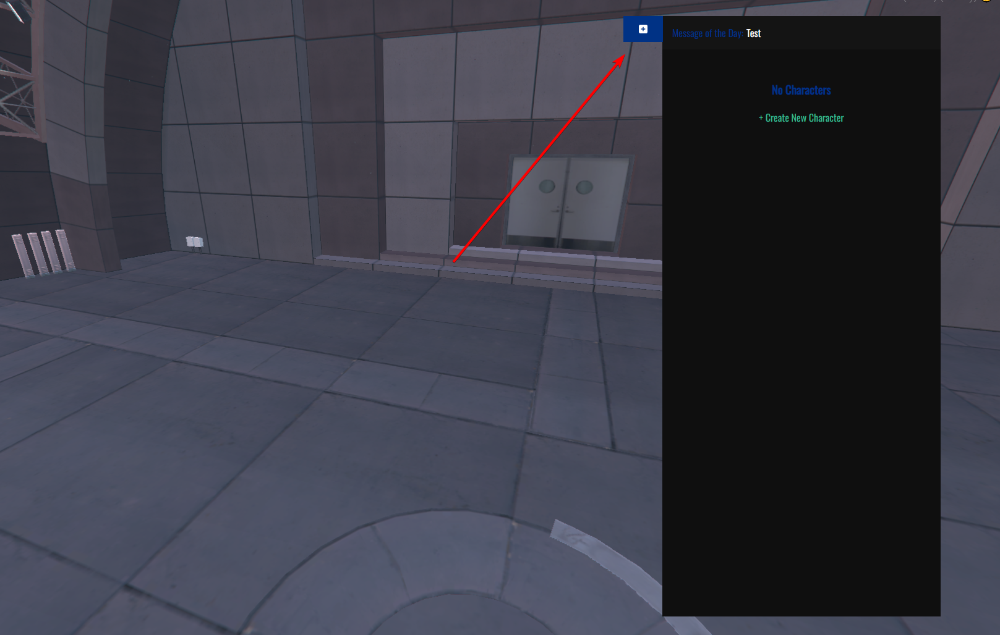
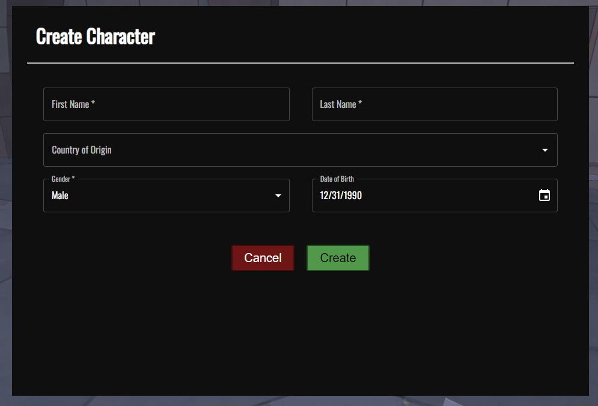
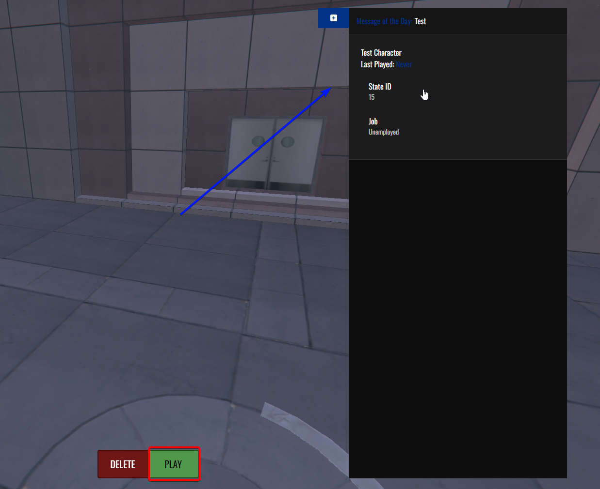
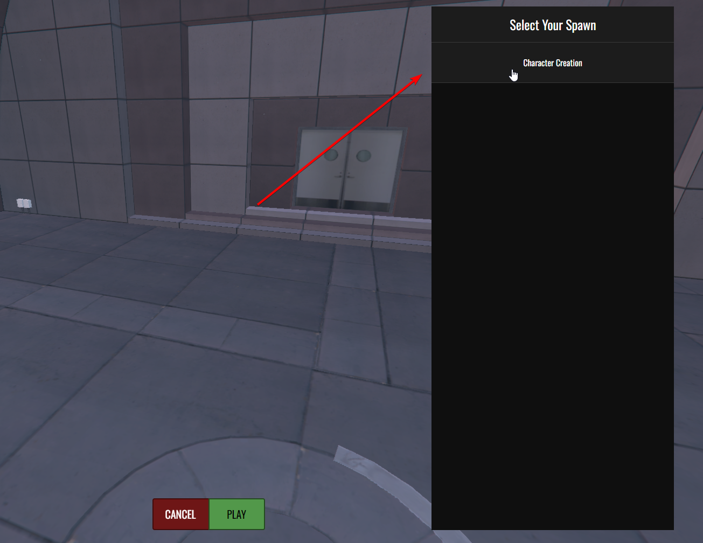

# יצירת דמות
שלב זה יהיה הדבר הראשון שתצטרכו לעשות שתיכנסו להיכנס לשרת ובו תצטרכו ליצור את הדמות שלכם

### כמה דגשים לפני שיוצרים דמות

מומלץ לפני שאתם יוצרים את הדמות לבוא עם **שם פרטי ותאריך לידה** לדמות כי דברים אלו לא ניתנים לשינוי לאחר מכן (תהליך זה הוא תהליך חד פעמי )

## תהליך יצירת הדמות

לאחר שנכנסתם לשרת אתם תראו את המסך הזה ותצטרכו ללחוץ על ה "+" בצד ימין למעלה

לאחר מכן יצוץ לכם המסך הזה ותצטרכו להזין את הפרטים הבאים **באנגלית**

שם פרטי של הדמות

שם משפחה של הדמות

מדינה ממנה עלתה הדמות (אפשר לשים ארצות הברית אם אתם רוצים להגיד שהדמות שלכם היא מקומית)

מין של הדמות

תאריך לידה של הדמות

לאחר שעשיתם זאת תלחצו עם כפתור ה "Create" הירוק והדמות שלכם תיווצר! אבל עוד לא סיימנו

יש עליכם ללחוץ על הקופסה בצד ימין שבה רשומה השם של הדמות שלכם ויופיע לכם 2 מקשים למטה

בשביל להיכנס לדמות תלחצו על כפתור ה "Play" הירוק

ובמידה ואתם לא מרוצים על השם / תאריך הלידה של הדמות וכו יש ללחוץ על כפתור ה "Delete" האדום בשביל למחוק את הדמות הקיימת וליצור חדשה

ולאחר שלחצתם על כפתור ה "Play" יש לנו שלב אחרון לפני עיצוב הדמות

יש ללחוץ על קוביית ה "Character Creator" וללחוץ על כפתור ה "Play" הירוק 

לאחר שעשיתם זאת **מזל טוב, יצרתם דמות** אבל עכשיו צריך לעצב אותה

[המדריך לעיצוב דמות](https://wiki.tegriai.com/servers/fivem/tutorials/character_customization)