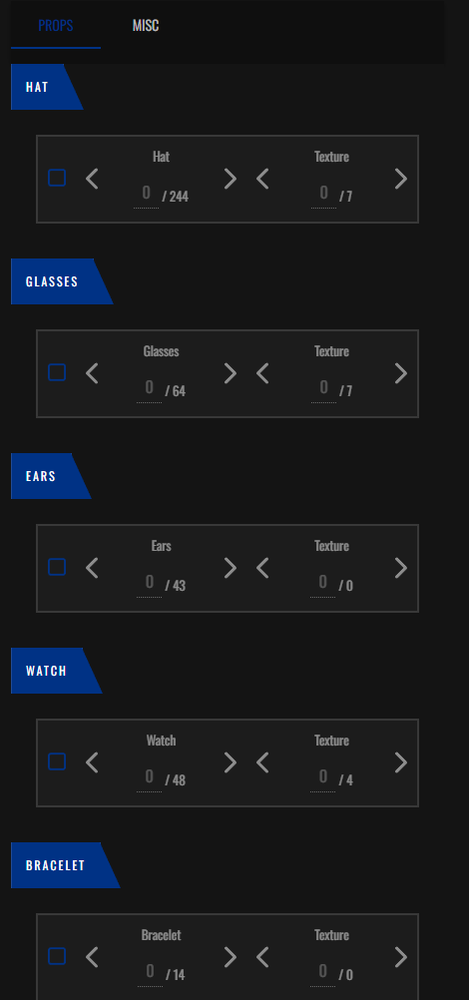
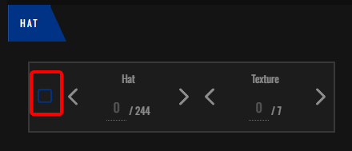

# עיצוב אביזרים
בדף זה תלמדו איך משנים ומוסיפים אביזרים לדמות שלכם כמו משקפיים, מסיכות, כובעים וכו

## אביזרים תמיד ניתנים לשינוי
ניתן לשנות את כל האביזרים בחנות בגדים בכל זמן נתון שתרצו

(תמונה של חנות הבגדים במפה)

# תהליך העיצוב

לאחר שלחצתם על כפתור מספר 6 בתפריט עיצוב הדמות

(הכפתור שנראה כך)

תועברנו לחלונית הזאת

לכל קטגורייה שנדבר עלייה יש שני דברים הניתנים לשינוי

אבל לפני שתהיה לכם גישה לשנות את הדברים האלו, בכל קטגוריה תצטרכו ללחוץ על הקופסה הריקה בשביל להפעיל את אותו אביזר

במידה ותלחצו על אותה קופסה שוב אותו אביזר יעלם גם במידה ושיניתם

"Type" = סוג האביזר והאביזר עצמו

"Texture" = שינוי הצבע של האביזר / שינוי כללי בנראות של אותו אביזר

אנחנו נסביר מה כל קטגורייה מייצגת מכיוון שתהליך השינוי הוא אותו הדבר

### תרגום כל קטגוריה

קטגוריית ה "Hat" מייצגת את הכובעים והקסדות שתוכלו ללבוש

קטגוריית ה "Glasses" מייצגת את המקשפת והמשקפיים שתוכלו ללבוש

קטגוריית ה "Ears" מייצגת את העגילים שתוכלו ללבוש (אפשרי גם אצל בנים וגם אצל בנות)

קטגוריית ה "Watch" מייצגת את השעונים שתוכלו ללבוש

קטגוריית ה "Shoes" מייצגת את הצמידים שתוכלו ללבוש

בשביל לעבור לאביזרים המינורים כמו שרשראות, מסכות וכו יש ללחוץ על המקש הזה בראשית התפריט

קטגוריית ה "Mask" מייצגת את המסכות שתוכלו ללבוש

קטגוריית ה "Bags" מייצגת את התיקים שתוכלו ללבוש

קטגוריית ה "Accesory" מייצגת את השרשראות והעניבות, במידה ואתם שוטרים גם את נרתיק הנשקים שתוכלו ללבוש (אין ללבוש את נרתיק הנשק סתם)

קטגוריית ה "Badges" מייצגת את המדבקות שתוכלו לשים על בגדים (הקטגורייה הזאת מתאימה לבגדים אז במידה ואתם לא עובדים מדינה (משטרה, שירותי רפואה וכו אין לגעת בקטגוריה הזו במידה ואתם לא יודעים מה אתם עושים))

# סיום

ופה סיימנו עם תפריט עיצוב האביזרים

