# עיצוב בגדים
בדף זה תלמדו איך משנים בגדים לדמות שלכם

## הבגדים תמיד ניתנים לשינוי
ניתן לשנות את כל הבגדים בחנות בגדים בכל זמן נתון שתרצו

סימון של חנות הבגדים במפה

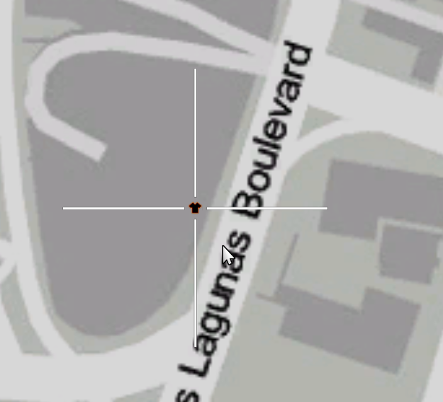

## הסבר על היררכיית החולצות

בGTA יש היררכיה מסויימת בסוגי החולצות שצריך ללבוש כדי שהתלבושת שלהם תראה כמו שצריך

**שאנחנו אומרים "הקטגוריה הכי גבוהה / נמוכה אנחנו למה שהכי רואים**

### ידיים

קטגוריית ה "Arms" היא הקטגוריה הכי נמוכה בהיררכיה

שינוי הקטגורייה תגרום שהגוף של הדמות לא תצא מהחולצות ולדמות לא יהיו ידיים בלתי נראות

דוגמא לידיים לא תקניות ביחס לחולצה

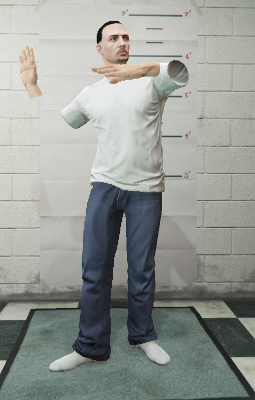

דוגמא לידיים תקניות ביחס לחולצה

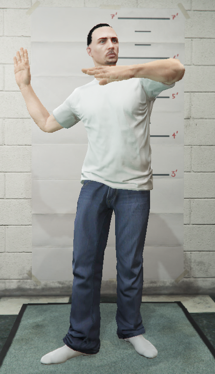

לכל חולצה הנמצאת בשרת יש ידיים המתאימות לה.

במידה ואתם מוצאים חולצה ללא ידיים מתאימות אתם מזומנים לפתוח כרטיס תמיכה בשרת הדיסקורד

### חולצה

קטגוריית ה "Under Shirt" היא הקטגוריה האמצעית בהיררכיה

לפי השם אפשר להבין שהקטגוריה מייצת את "החולצה למטה"

הקטגוריה הזאת בעיקר משומשת לחגורות משטריות ולחולצות מתחת לחליפות

דוגמא לחולצה לא תקינה בבגד רגיל

דומא לחולצה תקינה בבגד רגיל

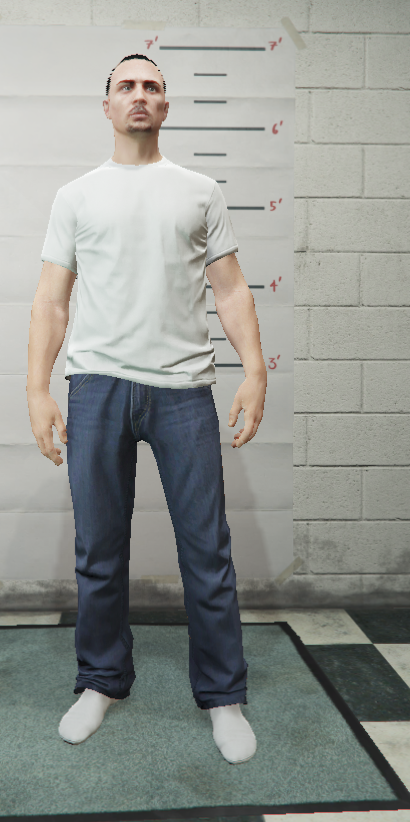

בעיקרון בתמונה למעלה החולצה למטה היא בלתי נראת כי אין צורך לראות משהו מלמטה

אבל למשל בחליפות יש צורך לכך

דוגמא לחולצה לא תקינה בחליפה

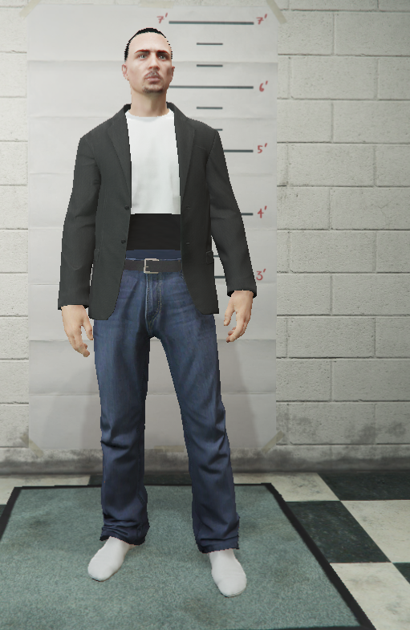

דוגמא לחולצה תקינה בחליפה

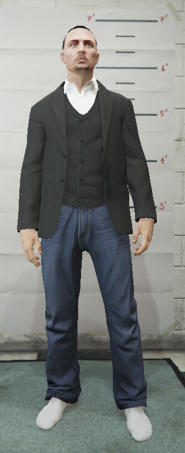

במידה ותרצו שיראו את הגוף מתחת לחליפה במקום חולצה תוכלו לעשות שילוב מעניין עם החולצה והיידים

על מנת לעשות זאת, תצטרכו למצוא חולצה בלתי נראה ולמצוא ידיים מתאימות (שינוי ידיים גם משנה איך הגוף יראה)

לדוגמא: נשים בחולצה את חולצה מספר 15 שהיא חולצה בלתי נראת ואני אקבל את התוצא הזאת

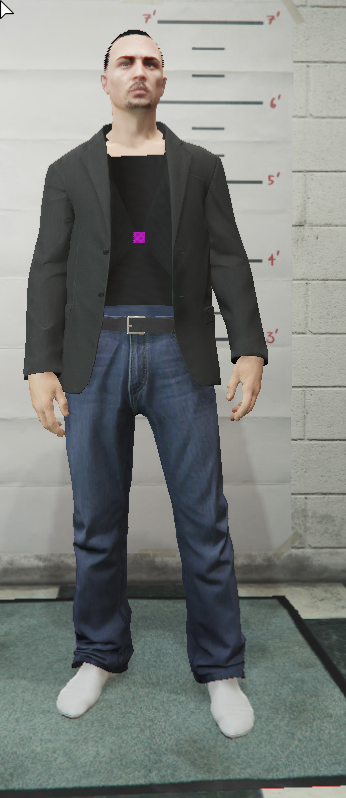

(בשביל חולצה בלתי נראת תמיד עדיף להשתמש בחולצה מספר 15)

ולאחר מכן אחפש ידיים מתאימות

למשל ידיים מספר 14

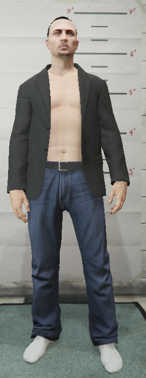

שאתם משנים ידיים יש לשים לב שהגוף לא יוצא מהחולצה

דוגמא: 

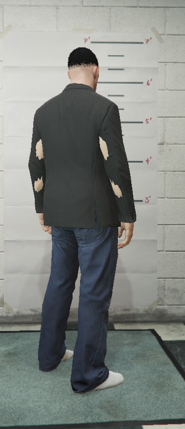

### ג'קט

קטגוריית ה "Jacket" היא הקטגוריה הגבוהה ביותר בהיררכיה

בקטגורייה זו אתם באמת שמים "ג'קט" שרואים למעלה מכל הקטגוריות שהוזכרו פה

נסביר את זה על ידי חצים

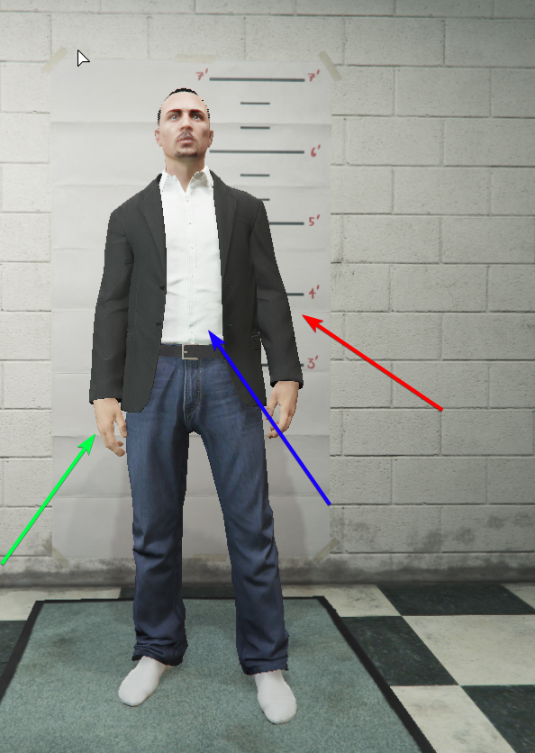

החץ האדום מסמל את ג'קט שאנחנו מדברים עליו עכשיו

החץ הכחול מדבר על החולצה שדיברנו עלייה לפני, שצריכה להשתנות ביחס לג'קט

והחץ הירוק מסמל את הידיים והגוף של הדמות מתחת לחולצה וג'קט, וצריכה להשנות ביחס לחולצה ולג'קט

**תהליך זה יכול להיות טיפה מבלבל אבל אתם תתפסו את זה לאחר מעקב אחרי כל המדריך**

## תהליך שינוי הבגדים

לכל קטגורייה שנדבר עלייה יש שני דברים הניתנים לשינוי

"Type" = סוג הבגד והבגד עצמו

"Texture" = שינוי הצבע של הבגד / שינוי כללי בנראות של אותו בגד

אנחנו נסביר מה כל קטגורייה מייצגת מכיוון שתהליך השינוי הוא אותו הדבר

### ידיים

קטגוריית שינוי היידים נמצאת בתפריד נפרד

בשביל להיכנס עליו תלחצו על המקש הזה בצד שמאל של המסך

ושם תראו את קטגוריית ה "Arms" ותשנו בהתאם למה שהוסבר

### הבגדים

בשביל להיכנס לתפריט הבגדים תצטרכו ללחוץ על המקש הזה בצד שמאל של המסך

משם תפתח לכם החלונית הזאת

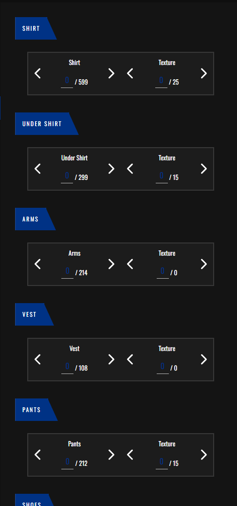

### תרגום כל קטגוריה

קטגוריית ה "Shirt" מייצגת את הג'קט שדיברנו עליו בהיררכיה. החולצה המרכזית שרואים למעלה

קטגוריית ה "Under Shirt" מייצגת את החולצה שדיברנו עלייה בהיררכיה. החולצה מתחת לחולצה המרכזית

קטגוריית ה "Vest" מייצגת את שיריון הגוף שתוכלו לשים על הגוף שלכם (שיריון הגוף הוא רק ויזואלי ובשביל לקבל אפקט של שיריון תצטרכו לרכוז מוצר כזה באחת החנויות בשרת)

קטגוריית ה "Pants" מייצגת את המכנסיים של הדמות שלכם, אם זה מכנסיים מאופרים, בוקסרים ועוד

קטגוריית ה "Shoes" מייצגת את הנעליים (קחו בחשבון שחלק מהמכנסיים יכולים להסתיר חלק מנעל שלכם)

# סיום

ופה סיימנו עם תפריט עיצוב הבגדים

מדריך זה הוא המדריך הכי מסובך מכל המדריכים שיש אבל הוא גם החשוב ביותר שיש

כדי להמשיך לעצב את הדמות מומלץ לעבור לתפריט האביזרים

[למדריך עיצוב האביזרים](accesories_customization.md)
