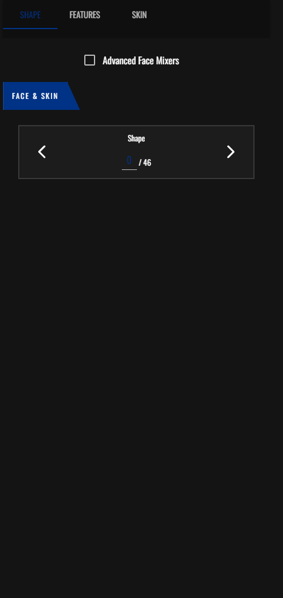
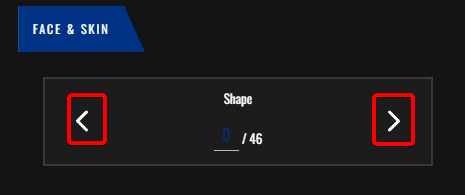
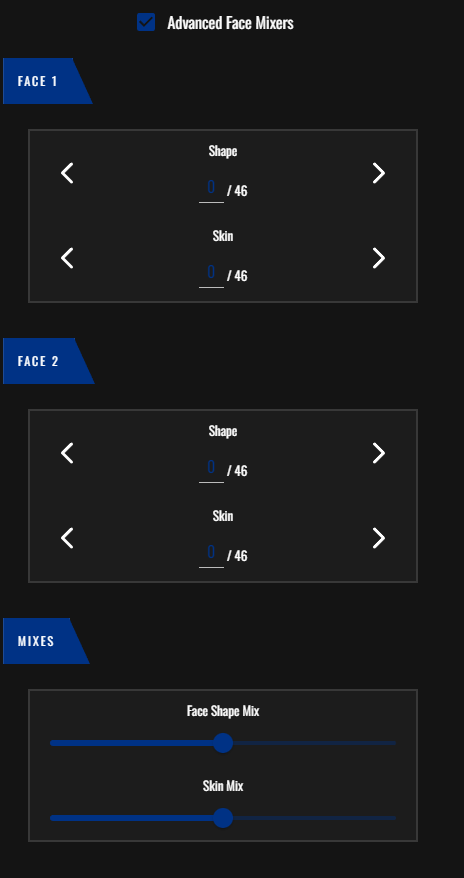
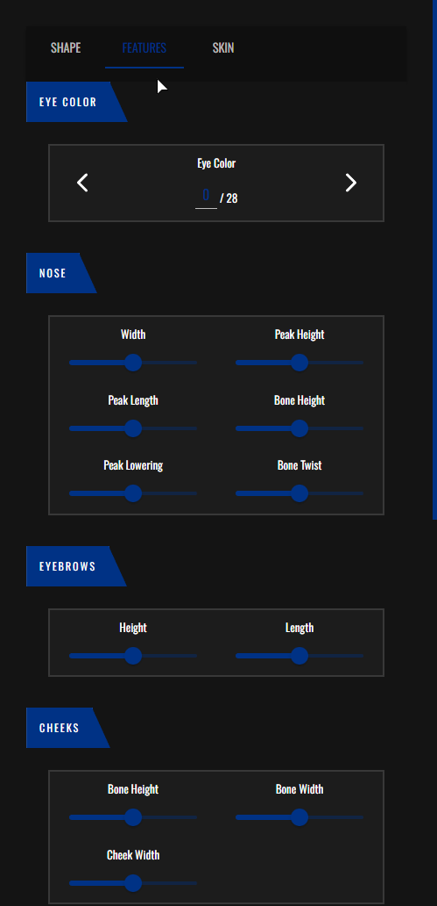
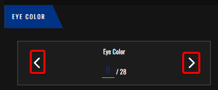
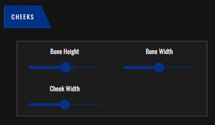
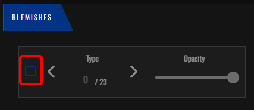
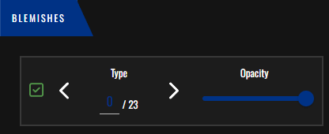
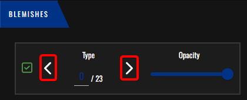

# עיצוב הפנים
בדף זה תלמדו איך לעצב הפנים שלכם

## דברים לקחת בחשבון

**קחו בחשבון ששינוי הפנים של הדמות לאחר ששמרתם זה משהו שאפשרי אבל יעלה הרבה כסף במשחק, קחו זמן לחשוב אם אתם מרוצים אם איך שאתם מעצבים את הפנים של הדמות לפני שאתם שומרים**

לאחר שלחצתם על מקש מספר אחד בצד שמאל של המסך

(המקש הזה)

תועברו לחלונית הזאת

# שינוי צורת הפנים 

לחיצה על "Shape" תעביר אתכם לשינוי צורת הפנים

על ידי לחיצה על החצים האלו תוכלו לעבור בין הפנים שכבר הכנו לכם מראש ולבחור אחד

אבל במידה ואתם רוצים לעצב פנים משלכם יש ללחוץ על המקש "Advanced Face Mixers"

לאחר שלחצתם עליו החלון יתרחב ותקבלו יותר אופציות

בואו נפרק את האופציות לשלושה חלקים

נקרא לקטגוריית ה "Face 1" **אבא**
לקטגוריית ה "Face 2" **אימא**
ולקטגוריית ה "Mixers" **שילובים**

בקטגוריות אימא ואבא יהיה לכם את הצורה של הפנים בתור "Shape" ואת צבע הגוף בתור "Skin"

המטרה שלכם ביצירת פנים מיוחדים היא לשלב בין האימא והאבא על ידי שינוי הצורה וצבע הגוף

במידה ואתם רוצים לתת יותר דגש לפנים של **האבא** יש לגרור את ה "Face Shape Mix" בקטגוריית **השילובים** שמאלה
בובמידה ואתם רוצים לתת יותר דגש לפנים של **האימא** יש לגרור את ה "Face Shape Mix" בקטגרויית השילובים ימינה

אותו דבר גם לצבע הגוף

במידה ואתם רוצים לתת יותר דגש לצבע הגוף של **האבא** יש לגרור את ה "Skin Mix" בקטגוריית השילובים שמאלה
בובמידה ואתם רוצים לתת יותר דגש לבצע הגוף של **האימא** יש לגרור את ה "Skin Mix" בקטגרויית השילובים ימינה

# שינוי תכונות הפנים

לחיצה על "Features תעביר אתכם לשינוי תכונות הפנים (גודל אף, צבע עיניים וכו')

## שינוי צבע עיניים

על ידי לחיצה על החצים תוכלו לעבור בין צבעי העיניים המוכנים

### טיפ

במידה ואתם לא רואים את העיינים של הדמות בצורה טובה תוכלו ללחוץ על המקש הזה בראשית המסך כדי לנעול את המצלמה על הפנים של הדמות

ובשביל לחזור למצב הקודם תצטרכו ללחוץ על המקש מימן לו

## שינוי שאר התכונות

תהליך שינוי שאר התכונות הוא דומה מאוד אז ניקח את שינוי הלחיים לדוגמא

בכל תכונה תוכלו לשנות את גובה ורוחב התכונה לפי מה שתרצו

בחלק מהתכונות תוכלו גם לשנות את גובה ורוחב העצם של אותה תכונה

על ידי שינוי ה "Bone Height" אוכל לשנות את גובה העצם, מה שאומר שעצם הלחי תעלה למעלה או למטה ביחס למה שאשנה

על ידי שינוי ה "Bone Width" אוכל לשנות את רוחב העצם, מה שאומר שעצם הלחי תצא החוצה או תיכנס פנימה ביחס למה שאשנה

על ידי שינוי ה "Cheek Width" אוכל לשנות את רוחב הלחי, מה שאומר שהלחי תצא החוצה או תיכנס פנימה ביחס למה שאשנה

תהליך שינוי התכונות הוא מאוד דומה, הכל עניין של ניסוי וטעייה וכמובן אם אתם לא מרוצים אם אחד מהתכונות ששיניתם תוכלו להחזיר את מיקום "המחוון" הכחול לאמצע בכולם והתכונה תחזור למקור

# שינוי תכונות עור הפנים

לחיצה על "Skin" תעביר אתכם לתפריט שינוי תכונות עור הפנים

בתפריט זה תוכלו לשנות ולהוסיף תכונות לעור שלכם כמו קמטים, פגמים, הסמקות וכו

כדי להתחיל לשנות כל קטגוריה תצטרכו ללחוץ על הקופסה הריקה בצד שמאל של כל קטגוריה (במקרה זה בקטגרויית הפגמים)

לאחר שתעשו זו תיפתח לכם האופצייה לשנות את אותה תכונה

**בכל קטגרוייה** תהליף השינוי הוא אותו הדבר אז נסביר איך משנים אחד ולאחר מכן נסביר מה הפירוש של כל קטגוריה

(דוגמא בפגמים)

על ידי לחיצה על החיצים תוכלו לדףדף בין סוגי הפגמים

ועל ידי הזזת מחוון ה "Opacity" תוכלו לשנות את מידת הנראות של הפגם

על ידי הזזתו שמאלה יהיה אפשר לראות אותו פחות וההפך לצד ימין

במידה ותרצו לבטל / לכבות את אותה קטגוריה תוכלו ללחוץ שוב על הקופסה הריקה מצד שמאל

## תרגום כל קטגוריה

קטגוריית ה "Ageing" מיועדת להוספת קמטים

קטגוריית ה "Makeup" מיועדת להוספת איפור

קטגוריית ה "Makeup Colors" מיועדת לשינוי צבע האיפור

קטגוריית ה "Blush" מיעודת להוספת הסמקות

קטגוריית ה "Blush Color" מיעודת לשינוי צבע ההסמקה

קטגורייה ה "Lipstick" מיועדת להוספת לאודם

קטגוריית ה "Lipstick Color" מיועדת לשינוי צבע האודם

קטגוריית ה "Complexion" מיעודת להוספת אדמומיות בפנים

קטגוריית ה "Sun Damage" מיועדת להוסף יובש בפנים

קטגוריית ה "Moles / Freckles" מיועדת להוספת נמשים

# סיום

ופה סיימנו עם תפריט עיצוב הפנים

כדי להמשיך לעצב את הדמות מומלץ לעבור לתפריט עיצוב השיער

[למדריך עיצוב השיער](hair_customization.md)
