# עיצוב שיער
בדף זה תלמדו איך לשנות / להוסיף שיער לדמות שלכם

## שיער הוא תמיד ניתן לשינוי
ניתן לשנות את כל פריטי השיער במספרה בכל זמן נתון שתרצו

(תמונה של המספרה במפה)

# תהליך העיצוב

לאחר שלחצתם על כפתור מספר 3 בתפריט עיצוב הדמות

(הכפתור שנראה כך)

תועברנו לחלונית הזאת

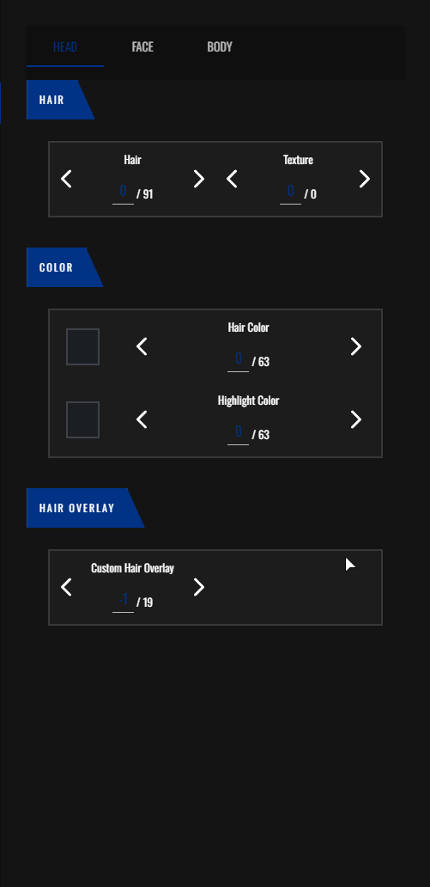

## עיצוב שיער הראש

בחלונית זו תוכלו לעצב ולשנות את השיער הנמצא לכם על הראש

### בחירת שיער

בקטגוריית ה "Hair" תוכלו להוסיף את השיער שלכם על ידי לחיצה על החיצים

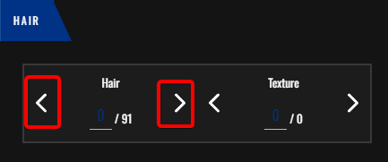

**לבנים ולבנות שיער שונה, אז אין אופצייה שבן ישים שיער של בת וההפך**

ומצד ימין תוכלו לשנות את טקסטורת השיער רק לאחר שבחרתם שיער

(טקסטורת השיער הוא לא הצבע)

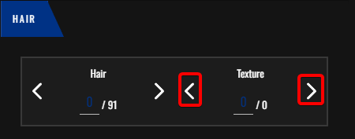

שינוי הטקסטורה תשנה את איך שהשיער מורכב אם זה אומר שהוא יהיה חלק, יהיה דליל וכו'

(לא ניתן לשנות טקסטורה בכל השערות)

### שינוי צבע השיער

בקטגוריית ה "Color" תוכלו לשנות את צבע השיער

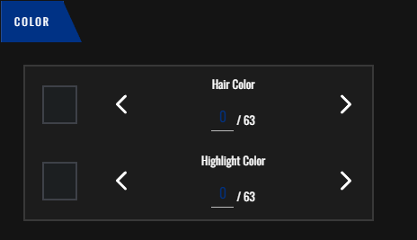

על ידי לחיצה על החצים תחת "Hair Color" תוכלו לשנות את הצבע של השיער שלכם

(הקובייה מימין תראה לכם את הצבע במקום לראות אותו על הדמות)

ועל ידי לחיצה על החצים תחת "Highlight Color" תוכלו להוסיף צבע מתחת לשיער

# הוספת פייד (שיער דוהה)

בקטגוריית ה "Hair Overlay" תוכלו להוסיף פייד (שיער דוהה)

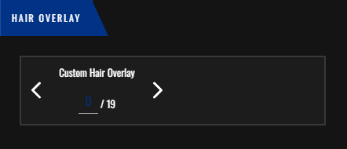

על ידי לחיצה על החיצים תחחת "Custom Hair Overlay" תוכלו להוסיף פייד 

(מומלץ להוסיף פייד רק במידה ויש לכם שיער)

## עיצוב שיער הפנים

על ידי לחיצה על "Face" תיפתח לכם חלונית עיצוב שיער הפנים

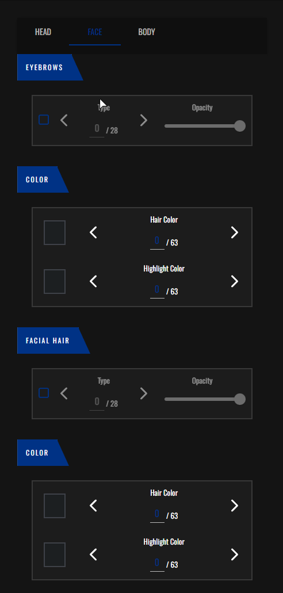

בקטגורייה זו תוכלו להוסיף גבות ושפמים / זקנים לדמות שלכם

**(חובה עליכם להוסיף גבות לדמות גם אם זה במידת נראות נמוכה)**

### הוספת גבות

על ידי להוסיף גבות תצטרכו ללחוץ על הקופסה הריקה מימין תחת קטגוריית ה "Eyebrows"

על ידי לחיצה על החצים תחת הכותרת "Type" תוכלו לשנות את סוג הגבות

ועל ידי שינוי המחוון תחת הכותרת "Opacity" תוכלו לשנות את מידת הנראות של הגבות

#### טיפ

במידה ואתם לא רואים את הגבות של הדמות בצורה טובה תוכלו ללחוץ על המקש הזה בראשית המסך כדי לנעול את המצלמה על הפנים של הדמות

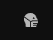

ובשביל לחזור למצב הקודם תצטרכו ללחוץ על המקש מימן לו

#### שינוי צבע הגבות

בשביל לשנות את צבע הגבות תצטרכו ללכת לקטגוריית ה "Color" הנמצאת מתחת לקטגוריית ה "Eyebrows"

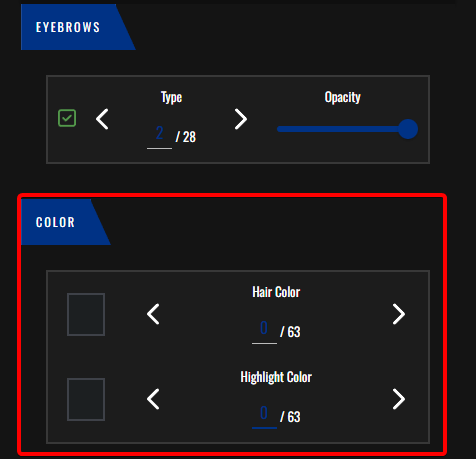

על ידי לחיצה על החצים תחת הכותרת "Hair Color" תוכלו לשנות את צבע הגבות

ועל ידי לחיצה על החצים תחת הכורתרת "Highlight Color" תוכלו להוסיף גוון לגבה במידה מינורית שבקושי רואים

### הוספת שפם

על ידי להוסיף שפם תצטרכו ללחוץ על הקופסה הריקה מימין תחת קטגוריית ה "Facial Hair"

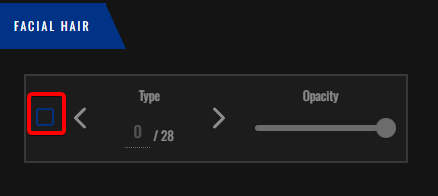

על ידי לחיצה על החצים תחת הכותרת "Type" תוכלו לשנות את סוג השפם

ועל ידי שינוי המחוון תחת הכותרת "Opacity" תוכלו לשנות את מידת הנראות של השפם

#### שינוי צבע השפם

בשביל לשנות את צבע השפם תצטרכו ללכת לקטגוריית ה "Color" הנמצאת מתחת לקטגוריית ה "Facial Hair"

על ידי לחיצה על החצים תחת הכותרת "Hair Color" תוכלו לשנות את צבע השפם

ועל ידי לחיצה על החצים תחת הכורתרת "Highlight Color" תוכלו להוסיף גוון לשפם במידה מינורית שבקושי רואים

## עיצוב שיער הגוף

על ידי לחיצה על "BODY" תיפתח לכם חלונית עיצוב שיער הפנים

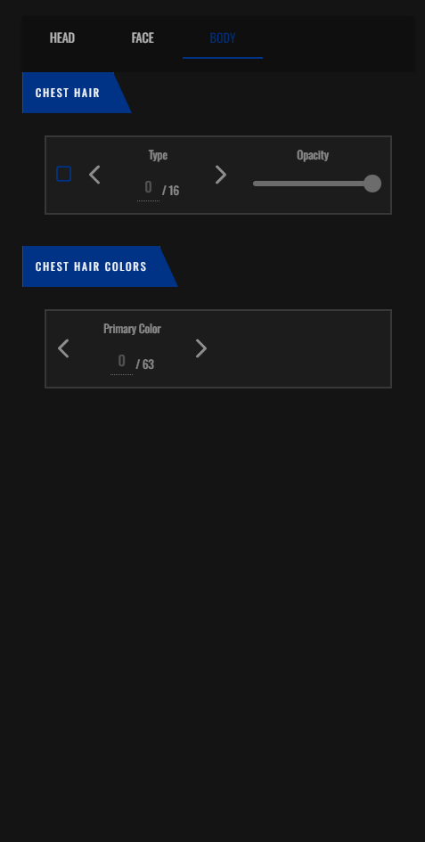

### הוספת שיער גוף

על ידי להוסיף שיער גוף תצטרכו ללחוץ על הקופסה הריקה מימין תחת קטגוריית ה "Chest Hair"

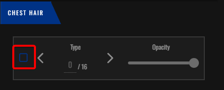

#### טיפ לפני הוספה

כדי לראות את השיער כמו שצריך מומלץ לעשות שני דברים:

מומלץ ללחוץ "R" במקלדת שלכם כדי שהשחקן יכנס לאנימצייה שיהיה קל לראות את השיער

האנימצייה:

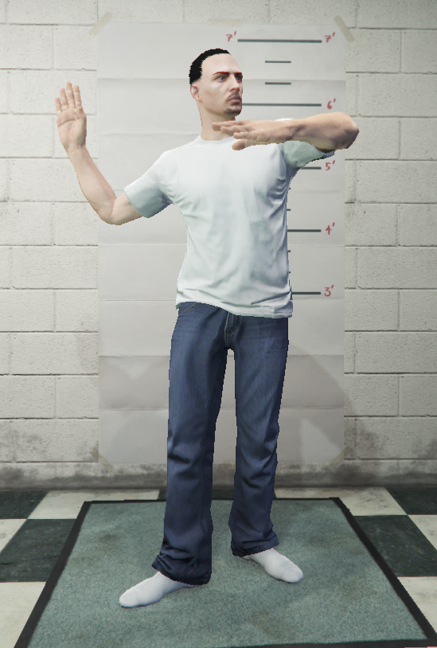

ומומלץ להוריד את הבגדים של הדמות על ידי לחיצה על הכפתור הזה בראשית המסך בצד שמאל

**הדמות לא תהיה ערומה!, לחיצה על המקש הזה תשאיר את הדמות עם בוקסר (במידה והדמות שלכם היא אישה אז עם תחתונים וחזייה) כדי לראות מה שקורה מתחת לבגדים כי שיער הגוף הוא גם שיער חזה וגם שיער בידים**

#### תהליך הוספת שיער הגוף

על ידי לחיצה על החצים תחת הכותרת "Type" תוכלו לשנות את סוג השיער

ועל ידי שינוי המחוון תחת הכותרת "Opacity" תוכלו לשנות את מידת הנראות של השיער

### שינוי צבע שיער הגוף

בשביל לשנות את צבע השפם תצטרכו ללכת לקטגוריית ה "Chest Hair Colors" 

על ידי לחיצה על החצים תחת הכותרת "Primary Color" תוכלו לשנות את צבע הגוף

# סיום

ופה סיימנו עם תפריט עיצוב הפנים

כדי להמשיך את הדמות מומלץ לעבור לתפריט עיצוב הבגדים

[למדריך עיצוב הבגדים](clothing_customization.md)

