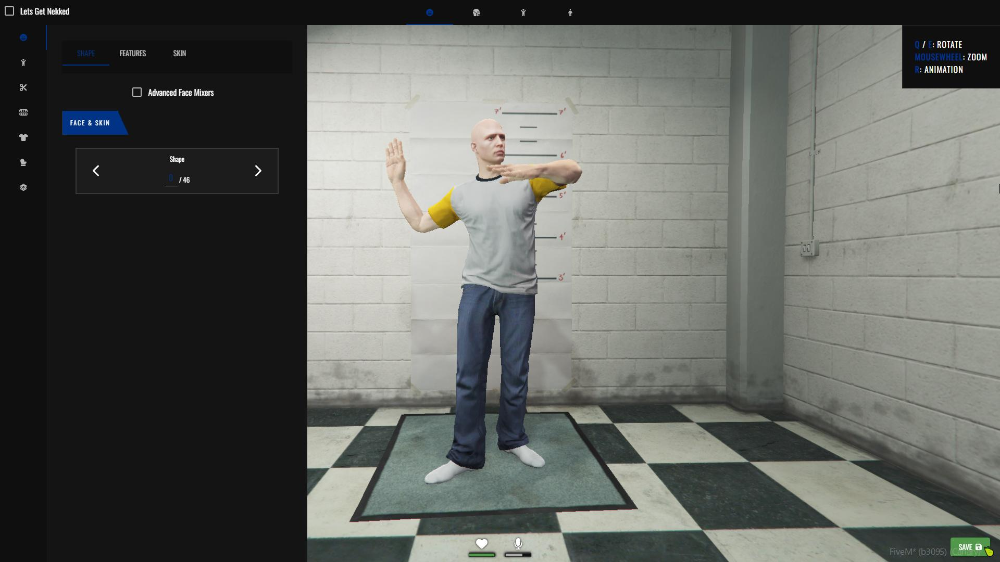
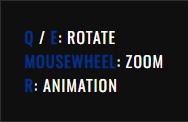
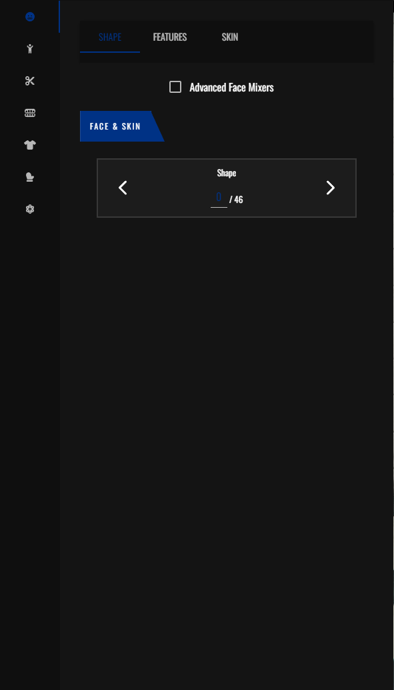
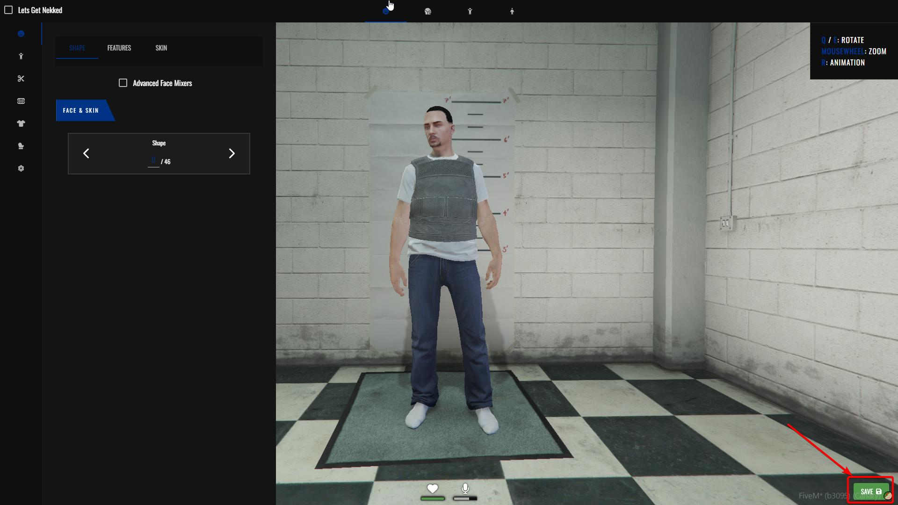

שלב זה יהיה השלב השני שתצטרכו לעשות לאחר שיצרתם את הדמות שלכם

[המדריך ליצירת דמות](https://wiki.tegriai.com/servers/fivem/tutorials/character_creator)

לאחר שיצרתם את הדמות שלכם תשוגרו לחדר מיוחד וזה מה שתראו

## הסבר על הכפתורים

הסמלים הלבנים בחלק העליון של התמונה ישנו את הפוקוס של המצלמה לפי הסמל

למשל הסמל הזה (האיש עם המסכה) יפקס את המצלמה על הפנים של השחקן

בצד ימין של המסך תהיה לכם רשימת לחצנים לשינוי מיקום הדמות, זום של המצלמה והפעלת האנימצייה (האנימצייה של הפסל שאפשר לראות בתמונה הראשונה) בשביל לוודא שכל הבגדים מתאימים אחד לשני

בצד שמאל של המסך יהיה לכם פאנל העיצוב

המקשים בצד שמאל יעבירו אתכם בין קטגוריות העיצוב וכותרות בחלק הימני יעבירו אתכם בין נושאי העיצוב בתוך הקטגוריה

(הסבר על כל מקש יהיה מלעלה למטה מה שאומר שהמקש למעלה זה מקש מספר אחד ומהקש האחרון זה מקש מספר 7)

מקש מספר אחד יעביר אתכם לקטגוריית עיצוב הפנים, זה אומר שינוי צבע אור, צורת פנים וכו

[למדריך לעיצוב הפנים](face_creation.md)

מקש מספר שתיים יעביר אתכם לקגוריית שינוי היידים (הדברים בטגקורייה זו יסוברו בדף המסביר על עיצוב הבגדים)

[למדריך לעיצוב הבגדים](clothing_customization.md)

מקש מספר שלוש יעביר אתכם לקגוריית עיצוב השיער של הדמות. בקטגוריה זו תוכלו לשנות כל מה שקשור לשיער של הדמות (שיער ראש, גבות, שיערות חזה וכו)

[למדריך עיצוב השיער](hair_customization.md)

<!-- 

מקש מספר ארבע יעביר אתכם לקטגוריית האיפור של הדמות. בקטגוריה זו תוכלו לשנות כל מה שקשור לאיפור (אודם, מייקאפ וכו)

[למדריך האיפור](makeup_customization.md) -->

מקש מספר חמש יעביר אתכם לקטגוריית עיצוב הבגדים של הדמות. בקטגוריה זו תוכלו לשנות כל מה שקשור לבגדים שלכם (גקט, חולצה, מכנס וכו)

[למדריך לעיצוב הבגדים](clothing_customization.md)

מקש מספר שש יעביר אתכם לקטגוריית עיצוב האביזרים של הדמות. בקטגוריה זו תוכלו לשנות כל מה שקשור לאביזרים של הדמות שלכם (כובע, משקפיים מסכה וכו)

[למדריך לעיצוב האביזרים](accesories_customization.md)

מקש השביעי ואחרון יעביר אתכם לקגוריית עיצוב האביזרים הקעקועים של הדמות. בקטגוריה זו תוכלו לשנות כל מה שקשור ללקעקועים של הדמות שלכם 

[למדריך לעיצוב קעקועים](tattoos_customization.md)

**ולאחר שעקבתם אחרי כל המדיריכים / שיניתם מה שאתם רוצים בדמות יש ללחוץ על מקש השמירה בצד ימין למטה של המסך**

## תזכורת

אין עליכם צורך לשנות ולהתעסק בכל קטגוריה אבל מומלץ להתעסק לפחות בשלושת הקטגוריות המרכזיות

[קטגוריית עיצוב הפנים](face_creation.md)

[קטגוריית עיצוב הבגדים](clothing_customization.md)

[וקטגוריית עיצוב השיער](hair_customization.md)