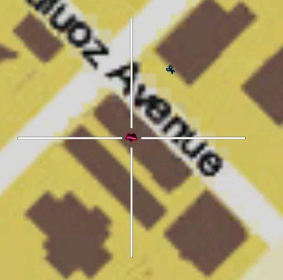
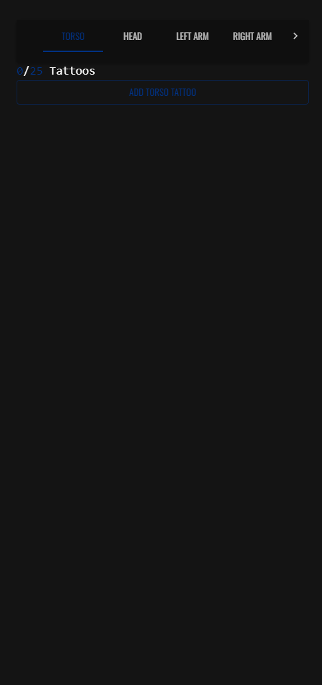
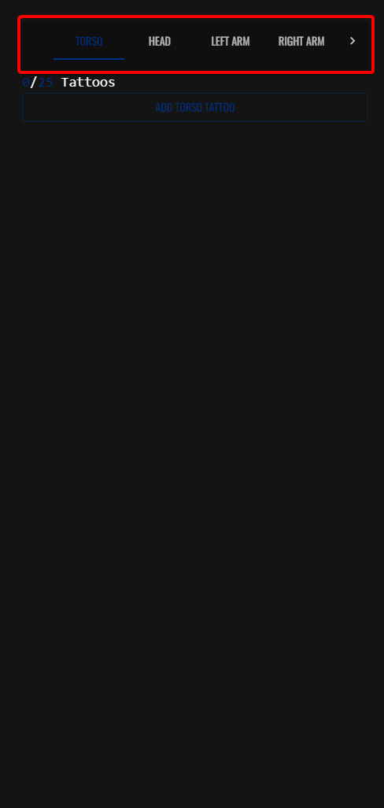
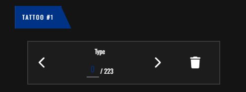

# עיצוב אביזרים
בדף זה תלמדו איך מוסיפים קעקועים לדמות שלכם

## אביזרים תמיד ניתנים לשינוי
ניתן לשנות את כל הקעקועים בחנות קעקועים בכל זמן נתון שתרצו

סימון של חנות הקעקועים במפה

# תהליך הוספת הקעקועים

לאחר שלחצתם על כפתור מספר 7 בתפריט עיצוב הדמות

(הכפתור שנראה כך)

תועברנו לחלונית הזאת

בשביל להוסיף קעקוע דבר ראשון תצטרכו לבחור איזור בגוף

תוכלו לבחור אזורים בחלק הזה של התפריט

ולאחר שבחרתם איזור, יש ללחוץ על הכפתור "Add Tattoo"

השם של הכפתור ישתנה לפי האיזור בשבחרתם

למשל בחרתי ב  "Torso" (שזה בעצם הגוף) השם של הכפתור יהיה "Add Torso Tattoo"

לאחר שלחצם על הכפתור יתווסף לכם קעקוע

(ניתן לשים עד 25 קעקועים על כל הגוף)

על ידי לחיצה על החצים בצדדים, תוכלו לשנות את סוג הקעקוע, בשביל להוריד את הקעקוע יש ללחוץ על כפתור "פח האשפה" שנמצא בצד הכי ימני של התמונה שסיפקנו למעלה

# סיום

ופה סיימנו עם תפריט עיצוב הקעקועים ותפריט עיצוב הדמות בכללי

מדריך זה הוא המדריך הכי קצר מבן כולם

