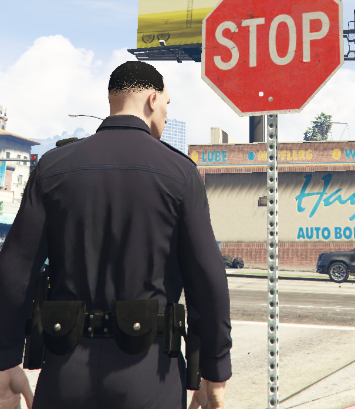
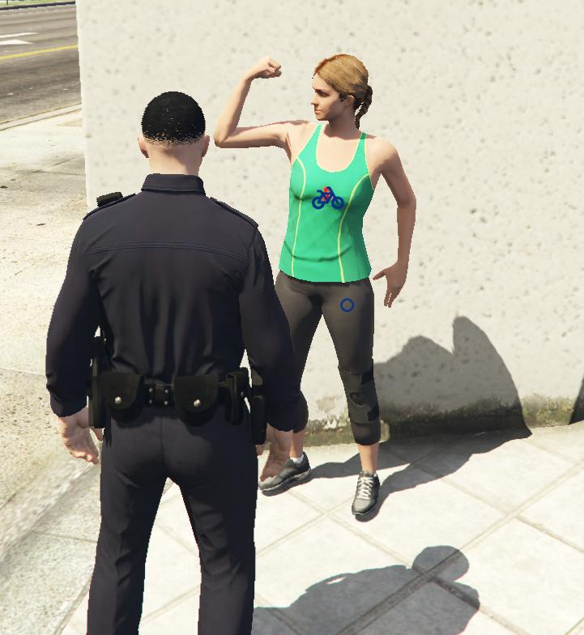
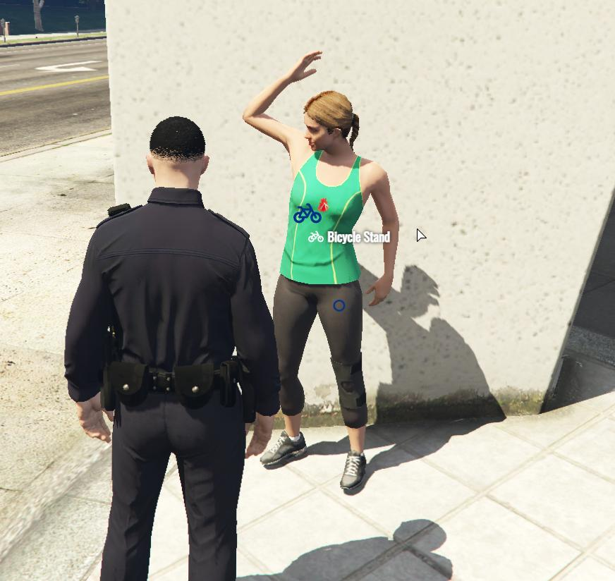
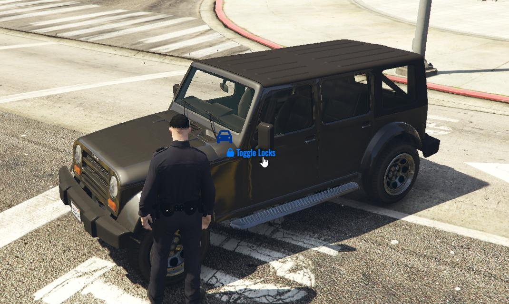
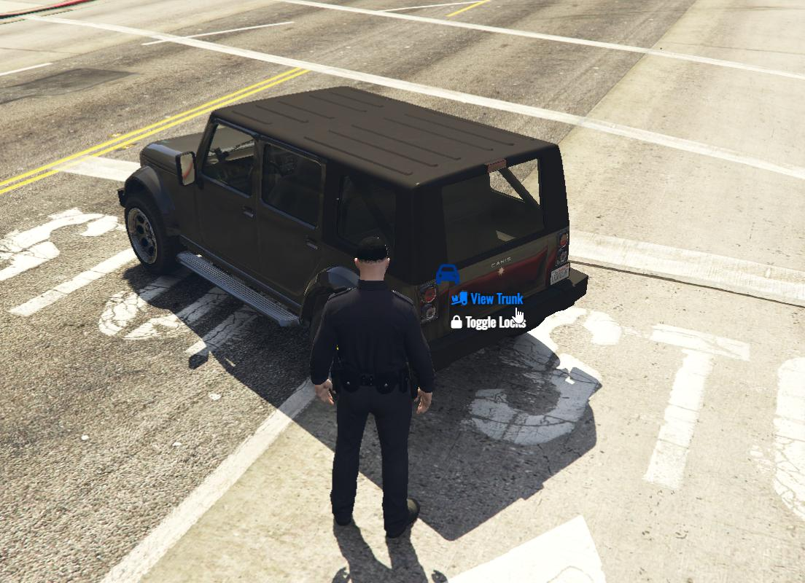
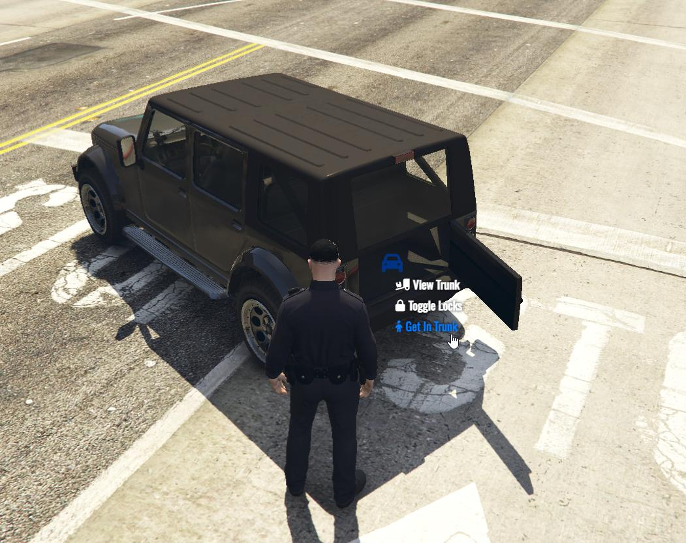

# נקודת הפעולה
נקודת הפעולה היא מערכת האינטרקצייה הראשית בשרת שאיתה אתם יכולים לבצע בפעולות עם אובייקטים שונים ברחבי המפה, לבצע פעולות על אנשים במצבים מסויימים ,לבצע פעולות על איזורים מסויימים ועוד.

מערכת זו יכולה להיות מאתגרת בהתחלה אבל בסופו של דבר היא קלה להבנה

## איך המערכת עובדת?

המערכת עובדת בכך שאתם צריכים להחזיק את המקש של "נקודת הפעולה" (ALT שמאלי במידה ולא שיניתם) בשביל להפעיל אותה, בזמן שתחזיקו אותה תופיע לכם נקודה לבנה על המסך וברחבי המפה יופיעו לכם עיגולים כחולים המסמנים על מיקומים שיכולה להיות בהם אינטרקצייה כזו או אחרת

### מצבי הנקודה

לנקודה שני מצבים

המצב הראשון הוא המצב "הלא פעיל". מה שאומר שלא מצאתם אינטרקציייה מסויימת ונקודה שלכם היא לבנה

דוגמא:

והמצב הפעיל שלה שאומר שיש לכם אופצייה לאינטרקצייה מסויימת איפה שאתם מתסכים והנקודה התחלפה לאייקון מסויים

בשביל לעשות את הפעולה שעלייה אתם מסתכלים תצטרכו בזמן שאתם במצב הפעיל ללחוץ "E" ויפתח לכם עכבר

:::info[מידע]
במידה ולחצתם "E" ולא נפתח לכם כלום, זה אומר שאין לכם גישה לאותה אינטרקצייה מסיבה כזו או אחרת.

חלק מהפעולות יכולות לקרות רק במצבים מסויימים לדוגמא: אופצייה של שדידת שחקן תופיע לי רק מתי שאותו שחקן מרים ידיים
:::

ולאחר מכן לקחת את העבר שלכם וללחוץ על הטקסט שהופיע

המערכת גם עובדת על רכבים במקומות מסויימים ברכב

דוגמא:

אני מסתכל על הרכב מקדימה ומופיעה לי רק האופצייה לנעול אותו

אני מסתכל על הרכב מאחורה ומופיעה לי גם האופצייה לפתוח את הבגאז' של האוטו

אני מסתכל על הרכב מאחורה בזמן שהבגאז' פתוח ומופעיה לי האופצייה להיכנס אליו

## האם אפשרי לשנות מקש?

(להוסיף פה)

## סיכום

המערכת היא מאוד מתקדמת ויש בה מגוון אינטרקציות ענק שתוכלו להשתמש בהם ולגלות בשרת

במידה ויש לכם שאלה לגבי המערכת אתם מוזמנים לפתוח כרטיס תמיכה [בשרת הדיסקורד שלנו](https://discord.gg/tg1rp)

