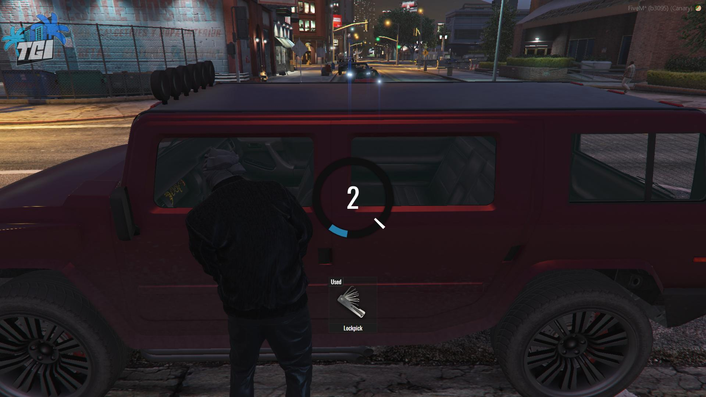
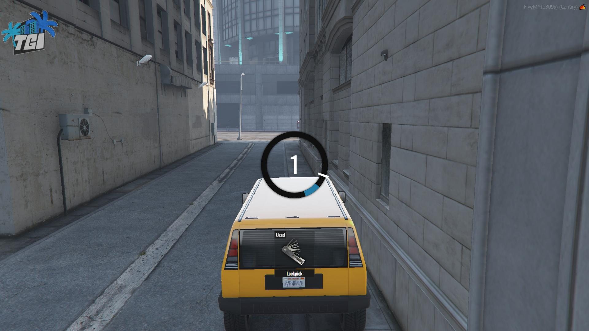

# מפתחות רכב

לכל רכב שנמצא בשרת יש מפתח שאיתו תוכלו להדליק / לכבות את המנוע ולנעול / לפתוח את הרכב שלכם

## באיזה מצבים אפשר לנהוג ברכב?

אפשר לנהוג ברכב כל עוד המנוע של אותו רכב שאתם נמצאים בו פתוח

מה שאומר שבמידה ויצאתי מהאוטו בלי לנעול אותו / לכבות את המנוע, **כל אחד** יכול לבוא ולנהוג ברכב **עד שהמנוע שלו יתכבה**

## העברת מפתחות

תמיד שתוציאו רכב [מהחנייה](garage.md) תקבלו אליו מפתח, שאותו תוכלו לחלוק עם חברים ואנשים אחרים

כדי לתת את המפתח תצטרכו להשתמש בפקודה **/givekeys** בזמן שאתם בתוך רכב או מחוצה לו ומתסכלים עליו

לאחר שתשתמשו בפקודה הזו המפתח שלכם ירד והמפתח יעבור למי שיושב בנהג במושב הנהג (או לבן אדם הקרוב ביותר אליכם במידה ואין מישהו במושב הנהג או שאתם במושב הננהג)

מה שאומר שאותו שחקן שקיבל את המפתח יוכל **להתניע ולנעול את האוטו** ואתם לא תוכלו לעשות זאת יותר

## פריצת רכב

גם אם אין לכם רכב, תוכלו לפרוץ רכבים שנמצאים ברחוב או רכבים של שחקנים אחרים

### פריצת דלת

כל רכב שמשתגר על ידי המשחק (רכב שהוא לא של שחקן) משתגר נעול (יש סיכוי לפעמים שהדלת תהיה פתוחה)

בשביל לפרוץ את הדלת תצטרכו להשתמש ב: **כלי פריצה / כלי פריצה מתקדם / מכשיר אלקרטרוני**
(מה שתצטרכו תלוי בנדירות ובשווי של הרכב)

לאחר שתשתמשו באחד מהפריטים שציונו למעלה יפתח לכם "משחקון" לפריצת הרכב

(ה"משחקון" יהיה שונה ביחס למה לכלי שתשתמשו בו)

לאחר שהצלחתם "במשחקון" הדלת תיפתח ותהיה לכם את האופצייה להיכנס ולפרוץ מבפנים

### פריצת הרכב (מבפנים)

בשביל לפרוץ את הרכב מבפנים תצטרכו להיות בתוכו ולהשתמש ב: **כלי פריצה / כלי פריצה מתקדם / מכשיר פריצה אלקרטרוני**

(מה שתצטרכו תלוי בנדירות ובשווי של הרכב)

לאחר שתשתמשו באחד מהפריטים שציונו למעלה יפתח לכם "משחקון" לפריצת הרכב

(ה"משחקון" יהיה שונה ביחס למה לכלי שתשתמשו בו)

לאחר שהצלחתם "במשחקון" הרכב יותנע ותקבלו את המפתחות של אותו רכב
