# מערכת השכרת רכב
במדריך זה תלמדו איפה אפשר להשכיר רכב, איזה רכבים אפשר להשכיר ואיך לא להפסיד כסף בזמן השכרת הרכבים

## סוגי השכרות הרכב

בשרת שלנו יש 4 סוגים של השכרות רכב

### השכרת אופניים

תוכלו לרכוש אופניים במחירים זולים מאוד כדי שתהיה לכם דרך זולה וקבועה להתנייד בתחילת הדרך שלכם בשרת

תוכלו לגשת לכל עמדת אופניים במפה בשביל לרכוש את האופניים

(סימון של העמדה במפה)

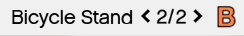

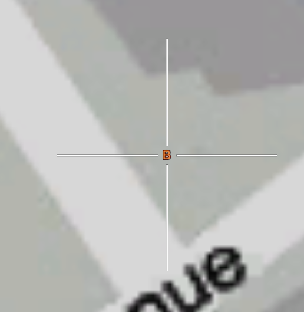

אחד מעדמות ההשכרה נמצאות ממש ליד דירת ההתחלה כדי שתוכלו להתנייד בשנייה שאתם יוצאים מהדירה!

#### תהליך הרכישה

שהגעתם לאחד מעדמות ההשכרה תהיה שם דמות, ותצטרכו להשתמש [בנקודת הפעולה](../interactions/targeting.md) בשביל לפתוח את תפריט הרכישה

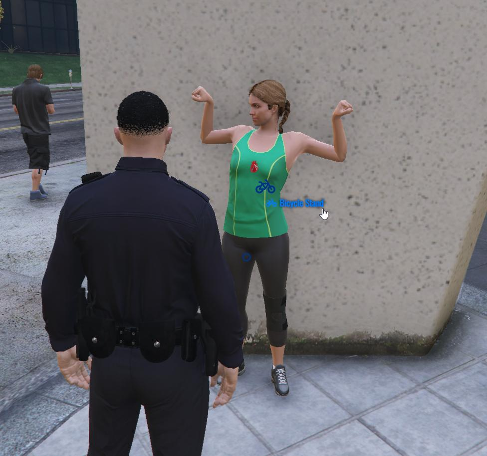

ולאחר שלחצתם על "Bicycle Stand" יפתח לכם התפריט הבא

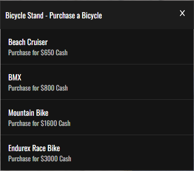

בתפריט הזה תראו 4 סוגי אופניים שתוכלו לקנות, ועל מנת לקנות יש ללחוץ על אחד מהם

:::warning[אזהרה]
תהליך הקנייה הוא מיידי, מה שאומר שבמידה ותלחצו על אחד מהאופניים אתם תקנו אותם ישר בלי שום אזהרה מוקדמת אז תשימו לב על מה אתם לוחצים
:::

ולאחר שרכשתם את אחד מהאופניים, האופניים ישתגרו מאחוריכם ותקבלו הודעה ארוכה בצד ימין

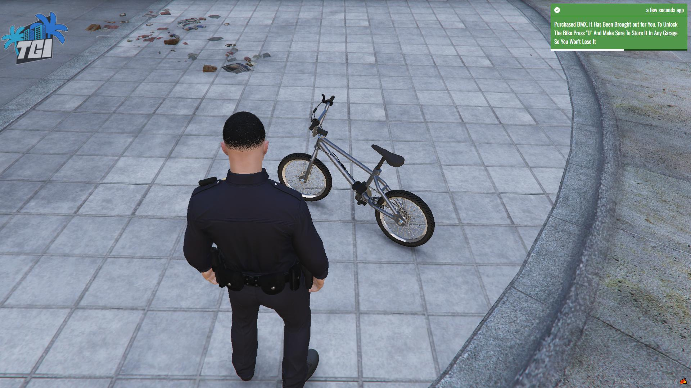

בהודעה יהיה רשום שהאופנוע נקנה והוא שלכם **לתמיד**. ובשביל להיכנס אליו תצטרכו לפתוח את המנעול שלו על ידי לחיצה על "U" (הסבר יותר מפורט על [מערכת המפתחות](keys.md)) ובשביל לשמור אותו ולא לאבד אותו תצטרכו לשמור אותו באחד מקומות החנייה בשרת (הסבר יותר מפורט על [מערכת החניות](garage.md))

תוכלו לעקוב אחרי האופניים שלכם באפליקציית החניות בטלפון בשביל לדעת באיזה חניה הם, מה המצב שלהם וכו'

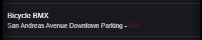

### השכרת מכונית

במידה ואופניים זה לא בשבילכם ואתם רוצים משהו יותר מהיר תוכלו גם להשכיר מכונית שיעזור לכם בצורה מהירה יותר בשרת

:::info[מידע]
המכוניות שתוכלו להשכיר פה **לא נשמרות** כמו האופניים וההשכרה היא חד פעמית, מה שאומר שאם המכונית מעוקלת או שהשרת עבר ריסטארט המכונית לא תחזור אליכם
:::

יש בשרת עמדה אחת להשכרת מכוניות

(סימון של העמדה במפה)

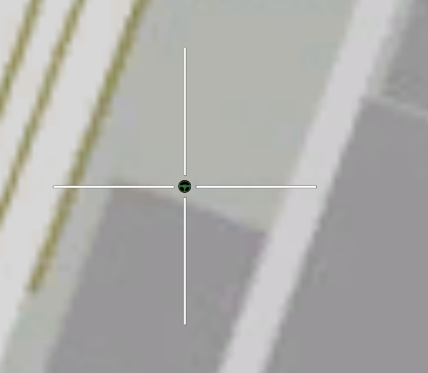

שהגעתם לאחד מעדמות ההשכרה תהיה שם דמות, ותצטרכו להשתמש [בנקודת הפעולה](../interactions/targeting.md) בשביל את התפריטים

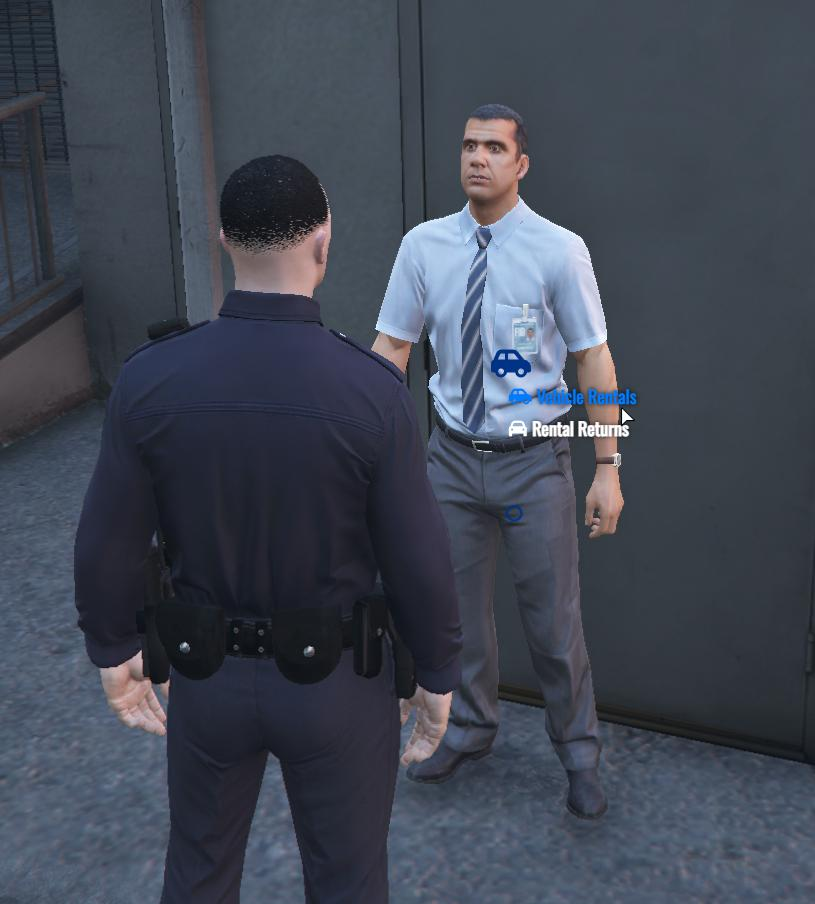

במקרה הזה, יש לנו שני אופציות שנעבור עליהם עכשיו

#### תהליך הרכישה

על ידי לחיצה על האופצייה "Vehicle Rentals" יפתח לכם תפריט בו תוכלו לראות את כל המכוניות שתוכלו להשכיר

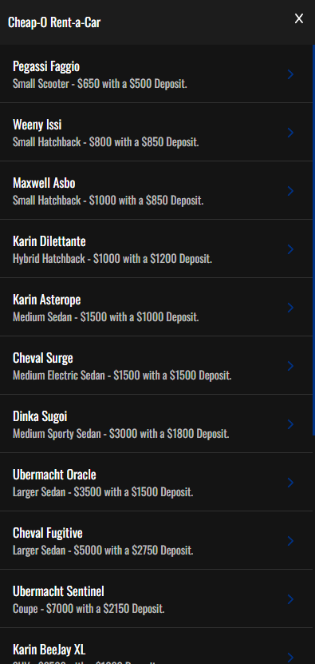

לכל רכב שני מחיר שתצטרכו לשלם על מנת להשכיר אותו, ובמידה ותלחצו על אחד מהמכוניות תוכלו לראות את שני המחירים ומה כל אחד מסמל

המחירים משתנים בין מכונית למכונית לפי הסוג, יכולת הנסיעה שלו וכו'

##### מחיר ההשכרה הראשי

מחיר ההשכרה הראשי הוא הסכום הרגיל שתצטרכו לשלם על אותה מכונית שתרצו לרכוש

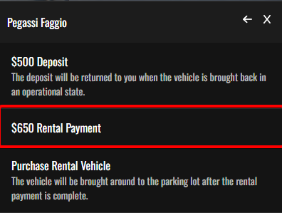

##### מחיר פיקדון

מחיר הפיקדון הוא הסכום השני שתשלמו על המכונית ותוכלו לקבל אותו חזרה במידה והחזרתם את הרכב במצב סביר לעמדה

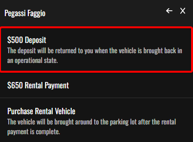

##### רכישת המכונית

בשביל לרכוש את המכונית תצטרכו ללחוץ על המקש הבא

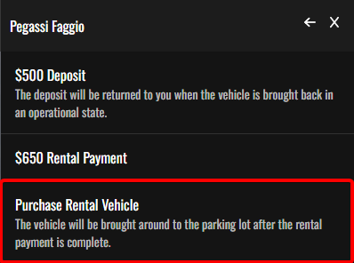

:::info[מידע]
מקש השכרת הרכב לא יהיה זמין ללחיצה במידה ואין עליכם את מחיר ההשכרה הראשי ומחיר הפיקדון במזומן עליכם
:::

לאחר שלחצם על המקש הכסף שאתם אמורים לשלם ירד מהמזומן שלכם, הרכב ישתגר מאחוריכם, תקבלו מפתח לאותה מכונית ותקבלו דף המסמל שהשכרתם את רכב

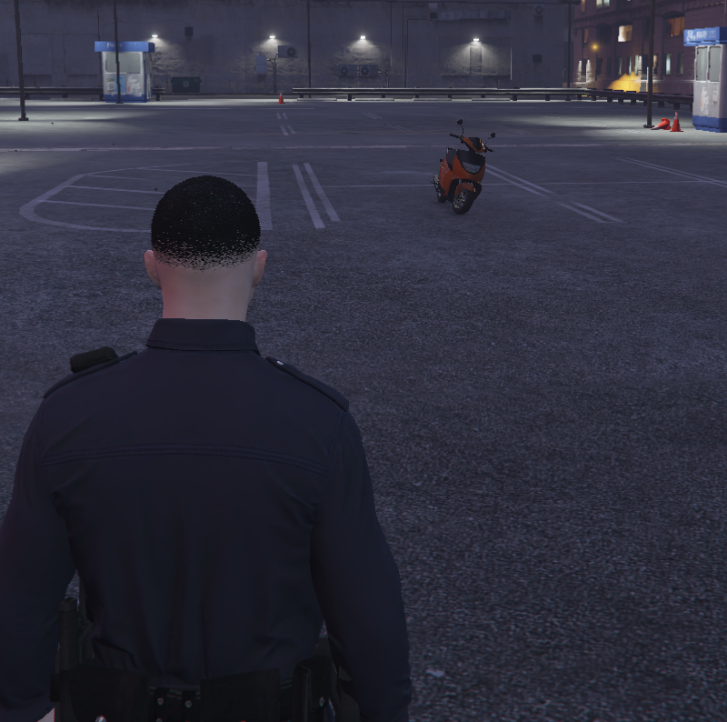

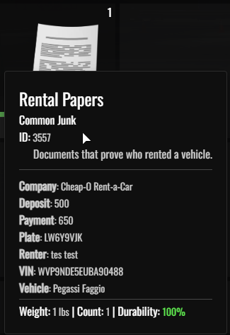

הדף הוא חלק חשוב מאוד בהשכרה, דף זה הוא כמו "שטר בעלות" זמני על האוטו שתוכלו להשתמש בו על מנת להציג לשוטרים שהרכב הוא שלכם לזמן מוקצב במידה והשוטר שואל אם הרכב שלכם והדף הזה גם משמש להחזרת הרכז וקבלת מחיר הפיקדון

#### תהליך החזרת הרכב

בשביל להיכנס לתפריט החזרת הרכבים יש ללחוץ על הכפתור "Rental Returns" 

ולאחר שתלחצו עליו יפתח לכם התפריט הבא

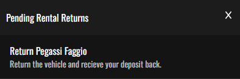

בתפריט הבא אתם תוכלו לראות את כל הרכבים שהשכרתם ולא החזרתם, במידה ותלחצו על הרכב שאתם רוצים להחזיר **ויש לכם את דפי ההשכרה שלו**, מחיר הפיקדון יחזור אליכם והרכב ימחק

### השכרת מכוניות יוקרה

במידה וגם מכוניות רגילות לא מספיקות לכם, יש את האופצייה לשכור רכבי יוקה בעמדות השכרה אחרות